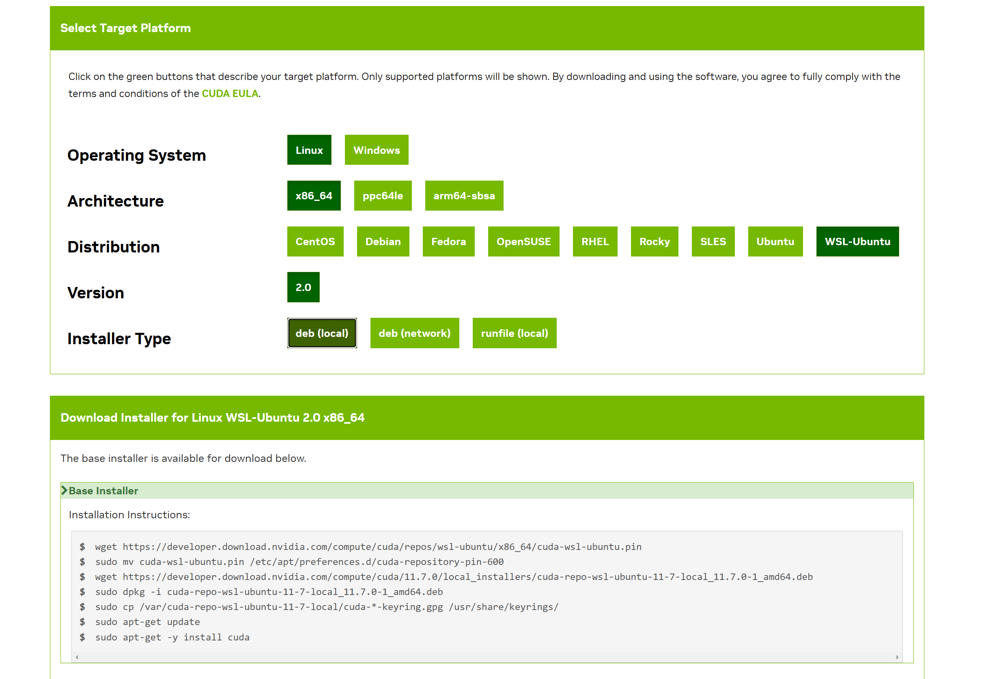

# 🐱 TensorRT快速入门指南

### TensorRT 生态系统

TensorRT 是一个庞大而灵活的项目。它可以处理各种转换和部署工作流程，哪种工作流程最合适取决于具体用例和问题设置。

#### TensorRT 基本工作流程

<figure><figcaption></figcaption></figure>

#### 转换和部署选项

TensorRT 生态系统分为两个部分：

1. 用户可通过各种途径将其模型转换为已经优化好的 TensorRT 引擎。
2. 用户在部署已经优化后的 TensorRT 引擎时，可将 TensorRT 作为推理 runtime。

<figure><figcaption></figcaption></figure>

使用 TensorRT 转换模型有三个主要选项：

* 使用 TF-TRT
* 自动从ONNX文件中完成转换
* 使用 TensorRT API（C++ 或 Python 语言）手动构建网络

对于 TensorFlow 模型的转换，TensorFlow 集成（TF-TRT）提供了模型转换和高级runtime API，并能在 TensorRT 不支持特定算子时返回到 TensorFlow 中去实现运行。

使用 ONNX 进行转换是一种性能更高的模型部署方式。TensorRT 支持使用 TensorRT API 或trtexec从 ONNX 文件中进行自动转换。使用ONNX 转换意味着模型中的所有操作都必须有 TensorRT 的支实现（或者必须为不支持的操作提供自定义插件）。ONNX 转换的结果是一个单一的 TensorRT 引擎，比使用 TF-TRT 的开销更少。

为了尽可能提高性能和可定制性，还可以使用 TensorRT 网络定义 API 手动构建 TensorRT 引擎。用 TensorRT 创建网络，只需导出模型的权重，然后将权重加载到网络中即可。

* [使用 C++ API 从零开始创建网络定义](https://docs.nvidia.com/deeplearning/tensorrt/developer-guide/index.html#create\_network\_c)
* [使用 Python API 从零开始创建网络定义](https://docs.nvidia.com/deeplearning/tensorrt/developer-guide/#create\_network\_python)

#### 部署

使用 TensorRT 部署模型有三种选择：

* 在 TensorFlow 中部署
* 使用独立的 TensorRT runtime API
* 使用英伟达 Triton 推理服务器

TF-TRT 转换模型的结果是一个插入了 TensorRT 操作的 TensorFlow 图。这意味着您可以像使用其他 TensorFlow 模型一样使用 Python 来运行 TF-TRT 模型。

TensorRT runtime  API 可以实现最低的开销和最精细的控制，但 TensorRT 本身不支持的算子必须以插件形式实现（[此处](https://github.com/NVIDIA/TensorRT/tree/main/plugin)提供了一个预编写插件库）。

最后，英伟达™ Triton推理服务器是一款开源推理服务软件，可帮助团队在任何基于GPU或CPU的基础设施（云、数据中心或边缘）上部署来自任何框架（TensorFlow、TensorRT、PyTorch、ONNX Runtime或自定义框架）、本地存储或谷歌云平台或AWS S3的人工智能模型。它是一个灵活的项目，具有一些独特的功能，例如异构模型和同一模型多个副本的并发执行（多个模型副本可进一步减少延迟）以及负载平衡和模型分析。 如果必须通过 HTTP 协议提供模型，例如在云推理解决方案中，它是一个不错的选择。可以[在这里](https://developer.nvidia.com/nvidia-triton-inference-server)找到英伟达™ Triton 推理服务器主页，[在这里找到](https://github.com/triton-inference-server/server/blob/r22.01/README.md#documentation)相关文档。

#### 选择正确的工作流程

在选择如何转换和部署模型时，有两个最重要的因素：

1. 模型所选用的框架。
2. TensorRT runtime。

下面的流程图涵盖了本指南中涉及的不同工作流程。该流程图将帮助您根据这两个因素选择合适的路径。

<figure><figcaption></figcaption></figure>

### 使用 ONNX 的部署示例

在本节中，我们将以部署预训练的 ONNX 模型为背景，介绍 TensorRT 转换的五个基本步骤。

在本例中，我们将使用 ONNX 格式转换一个预训练的 ResNet-50 模型；ONNX 是一种与框架无关的模型格式，可从大多数主流框架（包括 TensorFlow 和 PyTorch）导出。有关 ONNX 格式的更多信息，请[点击此处](https://github.com/onnx/onnx/blob/main/docs/IR.md)。

<figure><figcaption></figcaption></figure>

#### 导出模型

TensorRT 根据文件类型不同提供了两种不同的文件转换方式：

* TF-TRT 使用 TensorFlow 保存好的模型文件。
* ONNXparser 要求模型保存在 ONNX 中。

在本例中，我们使用的是 ONNX 模型文件。

使用wget从 [ONNX model zoo](https://github.com/onnx/models) 下载预训练的 ResNet-50 模型并解压缩

<pre class="language-sh"><code class="lang-sh"><strong>wget https://download.onnxruntime.ai/onnx/models/resnet50.tar.gz 
</strong>tar xzf resnet50.tar.gz
</code></pre>

这将解压缩一个预训练的 ResNet-50.onnx文件到resnet50/model.onnx 路径下。

#### batchsize的选择

batchsize会对模型的优化将产生很大影响。一般来说，在推理时，当我们想优先考虑延迟时，我们会选择较小的batchsize，而当我们想优先考虑吞吐量时，我们会选择较大的batchsize。较大的batchsize需要更长的处理时间，但可以减少每个样本的平均处理时间。

如果在运行前不知道需要多大的batchsize，TensorRT 可以动态处理batchsize大小。也就是说，固定的batchsize会让 TensorRT 进行额外的优化(a fixed batch size allows TensorRT to make additional optimizations.)。在本示例中，我们使用的固定batchsize为 64。

```
BATCH_SIZE=64
```

#### 精度的选择

推理所需的数字精度通常低于训练所需的精度。较低的精度可以加快计算速度，降低内存消耗，而不会牺牲任何精度。TensorRT 支持 TF32、FP32、FP16 和 INT8 精度。FP32 是大多数框架的默认训练精度，因此我们将首先使用 FP32 进行推理

```
import numpy as np
PRECISION = np.float32
```

我们将在下一节中设置 TensorRT 引擎在运行时所使用的精度。

#### 转换模型

ONNX 转换为 TensorRT 引擎是最通用、性能最好的方式之一。它适用于 TensorFlow、PyTorch 和许多其他框架。

有几种工具可以帮助你将 ONNX 模型转换为 TensorRT 引擎。一种常见的方法是使用trtexec，它是 TensorRT 附带的一个命令行工具，可以将 ONNX 模型转换为 TensorRT 引擎并对其进行剖析。

我们可以按以下方式运行转换

```
trtexec --onnx=resnet50/model.onnx --saveEngine=resnet_engine.trt
```

这将把resnet50/model.onnx转换为名为resnet\_engine.trt 的 TensorRT 引擎。注意：

*   要告诉trtexec在哪里找到我们的 ONNX 模型

    ```
    --onnx=resnet50/model.onnx
    ```
*   要告诉trtexec保存优化后的 TensorRT 引擎的位置

    ```
    --saveEngine=resnet_engine_intro.trt
    ```

#### 部署模型

成功创建 TensorRT 引擎后，我们如何使用 TensorRT 运行它。

TensorRT runtime有两种类型：一种是与 C++ 和 Python 绑定的独立runtime，另一种与 TensorFlow 集成的 API。在本节中，我们将生成一批随机的 "假 "数据，并使用ONNXClassifierWrapper这个类在该批数据上运行推理。

1.  设置ONNXClassifierWrapper

    ```python
    from onnx_helper import ONNXClassifierWrapper 
    N_CLASSES = 1000 # Our ResNet-50 is trained on a 1000 class ImageNet task
    trt_model = ONNXClassifierWrapper("resnet_engine.trt", [BATCH_SIZE, N_CLASSES], target_dtype = PRECISION)
    ```
2.  设置模型的输入

    ```
    BATCH_SIZE=32 
    dummy_input_batch = np.zeros((BATCH_SIZE, 224, 224, 3), dtype = PRECISION)
    ```
3.  向引擎输入一批数据，然后得到预测结果。

    ```
    predictions = trt_model.predict(dummy_input_batch)
    ```

请注意，在运行第一个batch之前，ONNXClassifierWrapper不会加载和初始化引擎，因此该batch处理通常需要比较长的一段时间。

### 使用 TensorRT runtime API

在模型转换和部署方面，使用 TensorRT runtime API是性能最好、最可定制的选择之一，该程序接口有 C++ 和 Python 版本。

TensorRT 包含一个带有 C++ 和 Python 绑定的独立运行时，与使用 TF-TRT 集成相比，其性能和可定制性通常更高。C++ API 的开销较低，但 Python API 与 Python 数据加载器以及 NumPy 和 SciPy 等库配合良好，更易于用于原型设计、调试和测试。

下面的教程说明了如何使用 TensorRT C++ 和 Python API 对图像进行语义分割。该任务使用了一个以 ResNet-101 为骨干的全卷积模型。该模型可接受任意大小的图像，并为每个像素生成相应的预测结果。

本教程包括以下步骤：

1. 导出ONNX模型，并使用trtexec生成TensorRT引擎
2. 使用TensorRT C++ API进行运行时的推理
3. 使用TensorRT Python API进行运行时的推理

#### 导出ONNX模型，并使用trtexec生成TensorRT引擎

1.  从[TensorRT 开源软件仓库](http://github.com/NVIDIA/TensorRT)下载快速入门教程的源代码。

    ```sh
    git clone https://github.com/NVIDIA/TensorRT.git 
    cd TensorRT/quickstart
    ```
2. 将[预先训练好的 FCN-ResNet-101](https://pytorch.org/hub/pytorch\_vision\_fcn\_resnet101/)模型转换为 ONNX。以下是相关的测试图片

<figure><figcaption></figcaption></figure>

a. 启动容器。

```bash
$ docker run --rm -it -gpus all -p 8888:8888 -v `pwd`:/workspace -w /workspace/SemanticSegmentation nvcr.io/nvidia/pytorch:20.12-py3 bash
```

b.运行导出脚本，将预训练模型转换为 ONNX。

```bash
$ python export.py
```


注：FCN-ResNet-101 有一个维度为\[batch, 3, height, width]的输入和一个维度为\[batch, 21, height, weight]的输出，其中包含对应于 21 个类别标签预测的概率值。在将模型导出到 ONNX 时，我们在输出端附加了一个argmax层，以生成每个像素概率最高的类别标签。



```python
import torch
import torch.nn as nn

output_onnx="fcn-resnet101.onnx"

# FC-ResNet101 pretrained model from torch-hub extended with argmax layer
class FCN_ResNet101(nn.Module):
    def __init__(self):
        super(FCN_ResNet101, self).__init__()
        self.model = torch.hub.load('pytorch/vision:v0.6.0', 'fcn_resnet101', pretrained=True)

    def forward(self, inputs):
        x = self.model(inputs)['out']
        x = x.argmax(1, keepdims=True)
        return x

model = FCN_ResNet101()
model.eval()

# Generate input tensor with random values
input_tensor = torch.rand(4, 3, 224, 224)

# Export torch model to ONNX
print("Exporting ONNX model {}".format(output_onnx))
torch.onnx.export(model, input_tensor, output_onnx,
    opset_version=12,
    do_constant_folding=True,
    input_names=["input"],
    output_names=["output"],
    dynamic_axes={"input": {0: "batch", 2: "height", 3: "width"},
                  "output": {0: "batch", 2: "height", 3: "width"}},
    verbose=True)
```


3. 使用[trtexec](https://github.com/NVIDIA/TensorRT/tree/main/samples/trtexec)工具从 ONNX 构建 TensorRT 引擎。

trtexec可以从 ONNX 模型生成 TensorRT 引擎，然后使用 TensorRT 运行时 API 进行部署。它利用[TensorRT ONNX 解析器](https://github.com/onnx/onnx-tensorrt)将 ONNX 模型加载到 TensorRT 网络图中，并利用 TensorRT 生成器[API](https://docs.nvidia.com/deeplearning/tensorrt/developer-guide/index.html#build\_engine\_c)(Builder API)生成优化引擎。构建引擎非常耗时，通常需要离线运行。

```bash
trtexec --onnx=fcn-resnet101.onnx --fp16 --workspace=64 --minShapes=input:1x3x256x256 --optShapes=input:1x3x1026x1282 --maxShapes=input:1x3x1440x2560 --buildOnly --saveEngine=fcn-resnet101.engine
```

执行成功后生成一个引擎文件。


–buildOnly ： 跳过推理性能测量（默认是禁用）


4. 可选择使用trtexec 生成随机值验证生成的引擎。

```bash
trtexec --shapes=input:1x3x1026x1282 --loadEngine=fcn-resnet101.engine
```

其中，--shapes为用于推理的动态形状输入设置输入大小。

如果成功，您应该会看到类似下面的内容

```bash
&&&& PASSED TensorRT.trtexec # trtexec --shapes=input:1x3x1026x1282 --loadEngine=fcn-resnet101.engine
```

#### 用 C++ 运行引擎

1.  在容器中编译并运行

    ```bash
    $ make
    $ ./bin/segmentation_tutorial
    ```

以下步骤展示了如何进行[反序列化](https://docs.nvidia.com/deeplearning/tensorrt/developer-guide/index.html#perform\_inference\_c)(Plan)然后推理。

1.  从文件反序列化 TensorRT 引擎。文件内容被读入缓冲区，并在内存中进行反序列化。

    ```cpp
    std::vector<char> engineData(fsize); 
    engineFile.read(engineData.data(), fsize); 
    std::unique_ptr<nvinfer1::IRuntime> runtime{nvinfer1::createInferRuntime(sample::gLogger.getTRTLogger())}; 
    std::unique_ptr<nvinfer1::ICudaEngine> mEngine(runtime->deserializeCudaEngine(engineData.data(), fsize, nullptr));
    ```
2.  TensorRT 执行上下文包含了一些执行状态(例如在推理过程中所需要的激活层的张量值),由于建立分割模型时启用了动态batchsize，因此必须指定输入的维度才能执行推理。可以通过查询网络输出维度来确定输出缓冲区的相应大小。

    ```cpp
    auto input_idx = mEngine->getBindingIndex("input");
    assert(mEngine->getBindingDataType(input_idx) == nvinfer1::DataType::kFLOAT);
    auto input_dims = nvinfer1::Dims4{1, 3 /* channels */, height, width};
    context->setBindingDimensions(input_idx, input_dims);
    auto input_size = util::getMemorySize(input_dims, sizeof(float));
    auto output_idx = mEngine->getBindingIndex("output");
    assert(mEngine->getBindingDataType(output_idx) == nvinfer1::DataType::kINT32);
    auto output_dims = context->getBindingDimensions(output_idx);
    auto output_size = util::getMemorySize(output_dims, sizeof(int32_t));
    ```

    > 注意：网络 I/O 的绑定索引可按名称查询。
3.  在准备推理时，会为所有输入和输出数据分配 CUDA 设备内存，image data is processed and copied into input memory, and a list of engine bindings is generated.

    对于语义分割，输入图像数据的处理方法是拟合到\[0, 1]范围内，并使用均值 \[0.485, 0.456, 0.406]和stddeviation\[0.229, 0.224, 0.225] 进行归一化。请参阅[此处](https://github.com/pytorch/vision/blob/main/docs/source/models.rst) torchvision模型的预处理要求。该操作由类RGBImageReader 抽象出来。

    ```
    void* input_mem{nullptr}; cudaMalloc(&input_mem, input_size); void* output_mem{nullptr}; cudaMalloc(&output_mem, output_size); const std::vector<float> mean{0.485f, 0.456f, 0.406f}; const std::vector<float> stddev{0.229f, 0.224f, 0.225f}; auto input_image{util::RGBImageReader(input_filename, input_dims, mean, stddev)}; input_image.read(); auto input_buffer = input_image.process(); cudaMemcpyAsync(input_mem, input_buffer.get(), input_size, cudaMemcpyHostToDevice, stream)；
    ```
4.  推理执行是通过上下文的executeV2或enqueueV2方法启动的。执行完成后，我们会将结果拷贝回主机缓冲区，并释放所有设备内存分配。

    ```cpp
    void* input_mem{nullptr};
    cudaMalloc(&input_mem, input_size);
    void* output_mem{nullptr};
    cudaMalloc(&output_mem, output_size); 
    const std::vector<float> mean{0.485f, 0.456f, 0.406f};
    const std::vector<float> stddev{0.229f, 0.224f, 0.225f};
    auto input_image{util::RGBImageReader(input_filename, input_dims, mean, stddev)};
    input_image.read();
    auto input_buffer = input_image.process();
    cudaMemcpyAsync(input_mem, input_buffer.get(), input_size, cudaMemcpyHostToDevice, stream);
    ```
5.  对预测结果进行可视化

    ```
    const int num_classes{21};
    const std::vector<int> palette{(0x1 << 25) - 1, (0x1 << 15) - 1, (0x1 << 21) - 1};
    auto output_image{util::ArgmaxImageWriter(output_filename, output_dims, palette, num_classes)};
    output_image.process(output_buffer.get());
    output_image.write();
    ```

    测试图像的预期输出如下：

<figure><figcaption></figcaption></figure>

#### 在 Python 中运行引擎

1.  安装所需的 Python 包

    ```bash
    $ pip install pycuda
    ```
2.  启动 Jupyter&#x20;

    ```bash
    $ jupyter notebook --port=8888 --no-browser --ip=0.0.0.0 --allow-root
    ```
3. 打开[tutorial-runtime.ipynb](https://github.com/NVIDIA/TensorRT/blob/main/quickstart/SemanticSegmentation/tutorial-runtime.ipynb)笔记本并按其步骤操作。

TensorRT Python runtime API 与 C++ runtime API一一映射。


