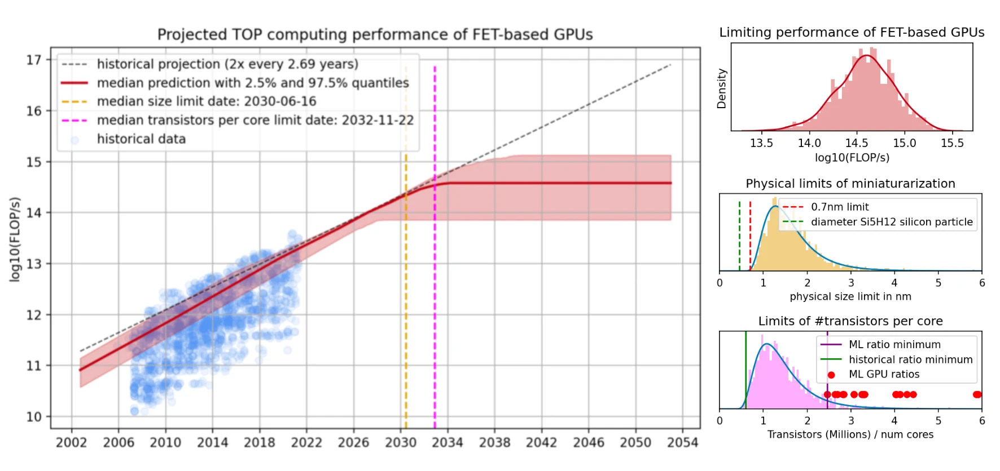
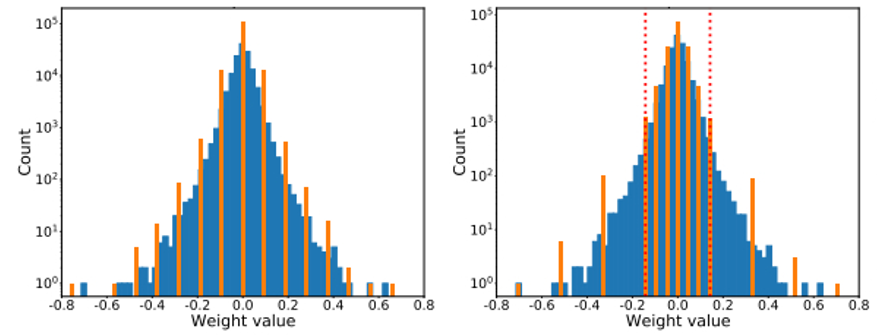
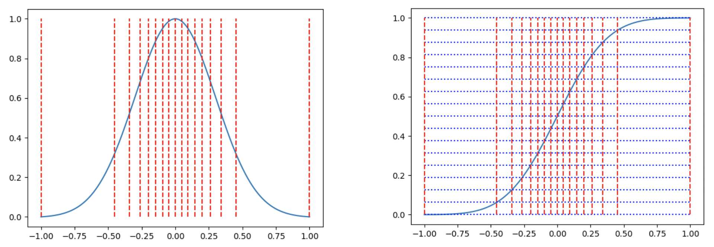

# 🤲 映射和偏移

### 近10年模型的变化与硬件的发展

DNN模型的大小，几乎在以每年10倍的FLOPs在增长

<figure><figcaption></figcaption></figure>

<figure><figcaption></figcaption></figure>

相比于模型的发展，硬件的发展速度很慢。即便硬件有了，还需要有相对应的的编译器。有了基本的编译器后，还需要有编译器的优化(TensorRT 3.x-8.x的演变)，还需要有一套其他的SDK。 Vision Transformer虽然在2020年左右兴起了，但是真正在硬件上达到如同现在的CNN的优化效果， 可能需要8-10年时间。 所以，大家一般会考虑如果用现有的硬件基础上减少模型计算量、增大模型计算密度等等。所以针对 这些需求，就有了“量化(quantization)”，“剪枝(Prunning)”等这些优化方法。

### 模型量化回顾

<figure><figcaption></figcaption></figure>

存储FP32需要4个字节，但存储INT8只需要一个字节。因为训练的时候，我们想训练到非常细节的部 分，所以我们使用FP32。但是如果我们在部署的时候只用8个bit就把FP32的数据给表现出来，那么 计算量以及能源消耗不就更好？模型量化就是做这个的。

### 什么是量化

模型量化是通过减少模型中计算精度从而减少模型计算所需要的访存量，进而 进一步提高计算密度的一种方法。计算精度可以分为FP32, FP16, FP8, INT8, INT32, TF32这些

量化针对的是&#x20;

* activation value&#x20;
* weight

所以一般来说我们会对conv或者linear这些计算密集型算子进行量化

<figure><figcaption></figcaption></figure>

### 量化会出现什么问题

fp32某个区间内的数值等于量化后int8上的一个点

<figure><figcaption></figcaption></figure>

<figure><figcaption></figcaption></figure>

仅仅用256种数据去表现FP32的所有可能出现的 数据，有可能会造成表现力下降。如果能够比较 完美的用这256个数据去最大限度的表现FP32的 原始数据分布，是量化的一个很大挑战。 换句话说，就是如何合理的设计这个dynamic range是量化的重点。

### 量化的基本原理: 映射和偏移

example🌰🌰🌰

$$
R{:}\{x|x\in[-100,0]x\in Z\}\\Q{:}\{y|y\in[0,20],y\in Z\}
$$

倘若想把R中的数据用Q来表示，如何做？

<mark style="color:red;">方法一(非对称量化)</mark>：&#x20;

根据R和Q中x和y可以取的最大值和最小值，计算得到一个缩放比(ratio)

$$
ratio=\frac{(R_{max}-R_{min})}{(Q_{max}-Q_{min})}
$$

以及缩放后的A要在B的范围中显示，所需要的偏移量(distance)

$$
distance=Q_{min}-\frac{R_{min}}{ratio}
$$

最终，通过ratio和distance的到x和y的关系

$$
y=\frac{x}{ratio}+distance
$$

利用上面的公式求得：

$$
\begin{aligned}
&ratio=\frac{(R_{max}-R_{min})}{(Q_{max}-Q_{min})}=\frac{100}{20}=5 \\
&distance=0-\frac{-100}{5}=20
\end{aligned}
$$

通过ratio和distance我们可以这么理解： Q中每一个元素可以代表R中每5个元素，并且偏移量是20。但是存在一个问题：

如果说可以通过下面的公式将R中的数据映射到Q中的话，

$$
y=\frac{x}{ratio}+distance
$$

那么我们按照下面的公式反着计算的话，是不是就可以通过Q中的数据得到R呢？

$$
x=(y-distance)*ratio
$$

<pre class="language-latex"><code class="lang-latex">y = 0, x = -100
y = 1, x = -95
y = 2, x = -90
<strong>y = 3, x = -85
</strong>y = 4, x = -80
</code></pre>

相比于原本的101个R中的数据，如今我们只能够得到R中21个数据。 比如说-96， -93， -81是无法得到的 ,那么问题出现在哪里？以及如何解决呢？

看看下面分布不同的四个数据

$$
R\colon\{x|x\in[-100,0]x\in Z\}\\Q\colon\{y|y\in[0,20],y\in Z\}
$$

<figure><figcaption></figcaption></figure>

很明显，虽然上述的4个example中数据都呈现-100\~0中，但是由于数据的分布形式不同，如 果我们统一都用一种ratio和distance的话，会有很大的误差。

* example1

R中的数据服从均匀分布，随机出现在 -100到0中。 这个时候因为数据分布是均匀，所以 将-100\~0均分20个部分映射到Q中效果是比较好的，误差也会比较小

<figure><figcaption></figcaption></figure>

* example2

R中的数据呈现高斯分布，主要集中 在-80\~-20中 这个时候R中的数据分布是属于正态 分布，所以数据主要集中在靠拢中间 的部分，靠近边缘的数据出现的概率 比较低。如果依然等分为20个部分的 话，靠近中间的数据会出现较大的误 差。

<figure><figcaption></figcaption></figure>

* example3

R中的数据呈现高斯分布，主要集中 在-65\~-45中 这个时候R中的数据分布是属于正态 分布，所以数据主要集中在靠拢中间 的部分。但是由于方差比较大，所以 接近两侧的数据几乎没有。如果按照 左图分配的话，Q中0-5, 15-20所代 表的数字没有意义。

<figure><figcaption></figcaption></figure>

* example4

R中的数据呈现高斯分布，主要集中 在-30\~-15中 这个时候R中的数据分布是属于正态 分布，所以数据主要集中在靠拢中间 的部分。但是由于方差比较大，以及 均值有所偏移，所以R中-100\~-30这 段区域几乎没有。将这段区域映射到 Q是没有意义的。

<figure><figcaption></figcaption></figure>

所以，为了能够让R到Q的映射合理，以及将Q中的数据还原为R时误差能够控制到最小，我们需 要根据R中的数据分布合理的设计这个ratio和distance。量化是一个数值映射过程：\[r0, r1, …,rk] -> \[q0, q1, …, qk] ，对于线性映射，并没有考虑原始数据本身的分布，如下图的正态分布，越靠近中间的 0，数据分布越密，左边是线性映射，量化后数值也同样会集中在中间的 0 附近，如果更极端一点，会导致大量的数值量化后都是 0， 显然这样就降低了量化的精度，而如果按右图，对数据分布密集的区域，给与更多的量化映射，就能增加量化后的差异性，提高精度。实际上，我们希望量化后的数据在量化空间应该均匀分布，而不是被原始数据的分布所影响。

<figure><figcaption></figcaption></figure>

非线性映射有多种实现，这里介绍一种分位量化方法（Quantile Quantization）：分位量化的基本想法是寻找一些分位点对原数据进行划分，使得各个区间的数据个数相等，然后将同一个区间的数据映射到同一个值，从而实现了量化。

<figure><figcaption></figcaption></figure>

如上图左边是一个类似于标准正态的分布图，红色竖线是16等分的分隔线，即相邻的分隔线截取的曲线面积相等，这样我们再把区间中的数都用区间中点来映射，即完成了分位量化，那如何求这些分隔线的位置呢？可以用累积分布函数的反函数来计算，如上图右图，累计分布函数(CDF)可以看作是左图积分图，我们把纵坐标进行16等分，那么等分线与CDF曲线的交点对应的横坐标即为分位点，我们用 Qx 表示CDF函数的反函数，qi 表示各个区间的中点，Qmap 是所有 qi 的集合，Qmap = \[q0, q1, … q2^k-1]，则有：

$$
q_i=\frac{1}{2}\left(Q_X\left(\frac{i}{2^k+1}\right)+Q_X\left(\frac{i+1}{2^k+1}\right)\right)
$$

实际计算过程中，需要先将数据归一化到合适的范围，并且对于确定的分布来说，分位点也是确定的，因此只需存储分位点的索引即可，整体步骤如下：

* 计算归一化常数 N=max(|T|) ，将输入张量T转化到目标量化数据类型的范围内
* Qmap 是 qi 的集合，对于T/N的每个元素，搜索在 Qmap 中最接近的对应值qi
* 将对应 qi 的索引 i 作为量化输出结果

### 量化的基本术语

目前为止我们所做的事情其实就是所谓的量化，我们稍微把一些概念和术语给整理一下&#x20;

* &#x20;R是一组FP32的数据，能够表现的数据种类有很多，大约是2^32种(4亿)，
* 范围是: −1.2 ∗ 10^−38\~3.4 ∗ 10^38&#x20;
* Q是一组INT8的数据，只能够表现2^8种数据(256)。&#x20;
* &#x20;范围是：-128 \~128 or 0 \~ 255&#x20;
* R到Q的映射的缩放因子scale的计算公式为：

$$
ratio=\frac{(R_{max}-R_{min})}{(Q_{max}-Q_{min})}
$$

* R缩放之后映射到Q时，所需要的偏移量z为：

$$
z=Q_{min}-\frac{R_{min}}{ratio}
$$

* 这样R中每一个元素转移到Q的过程称为量化(Quantization)，公式是:

$$
Q_{i}=\frac{R_{i}}{scale}+z
$$

* 将Q空间中一个元素转换回R的空间的过程为反量化(Dequantization)，公式是:

$$
R_{i}=(Q_{i}-z)*scale
$$

* 对称映射，非对称映射

<figure><figcaption></figcaption></figure>

如上图，对称映射的 Z 始终为 0， 即原数值的 0 量化后仍然是 0，量化前后的数值都是以 0 为中点对称分布，但实际上有些数值的分布并不是左右对称的，比如 ReLU 激活后都是大于 0，这样会导致量化后 q 的范围只用到了一半，而非对称映射则解决了这个问题。

非对称映射的 min、max 独立统计，Z 的值根据 r 的分布不同而不同，这样可以使 q 的范围被充分利用。

我们来看一个实际的例子：量化 FP32 \[-1.8, -1.0, 0, 0.5] 到 INT8 \[0, 255] (非对称)：

1. rmin = -1.8，rmax = 0.5， bitWidth = 8
2. S = (rmax – rmin)/(qmax – qmin) = (0.5 – (-1.8)) / (255 – 0) = 0.009019607843
3. Z = qmin – rmin/S = 255 – (-1.8)/S = 199.56521739 ≈ 200
4. 量化结果：q = round(\[-1.8, -1.0, 0, 0.5] / S + Z) = \[0, 89, 200, 255]

反量化：

1. r’ = S \* (\[0, 89, 200, 255] – Z) = \[-1.80392157, -1.00117647, 0, 0.49607843]

可以看到：反量化后数值对比原始数值存在一定误差。

### Reference

* [https://www.lesswrong.com/posts/vnvGhfikBbrjZHMuD/predicting-gpu-performance](https://www.lesswrong.com/posts/vnvGhfikBbrjZHMuD/predicting-gpu-performance)
* [https://arxiv.org/abs/2202.05924](https://arxiv.org/abs/2202.05924)
* [https://robot9.me/ai-model-quantization-principles-practice/](https://robot9.me/ai-model-quantization-principles-practice/)
* [https://www.researchgate.net/publication/357408276\_A\_Case\_Study\_of\_Quantizing\_Convolutional\_Neural\_Networks\_for\_Fast\_Disease\_Diagnosis\_on\_Portable\_Medical\_Devices?\_tp=eyJjb250ZXh0Ijp7InBhZ2UiOiJfZGlyZWN0In19](https://www.researchgate.net/publication/357408276\_A\_Case\_Study\_of\_Quantizing\_Convolutional\_Neural\_Networks\_for\_Fast\_Disease\_Diagnosis\_on\_Portable\_Medical\_Devices?\_tp=eyJjb250ZXh0Ijp7InBhZ2UiOiJfZGlyZWN0In19)
