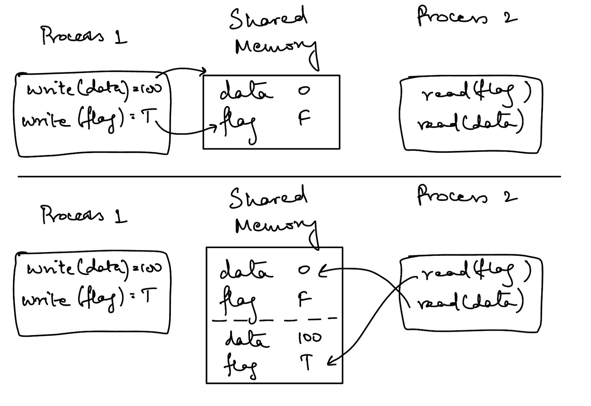
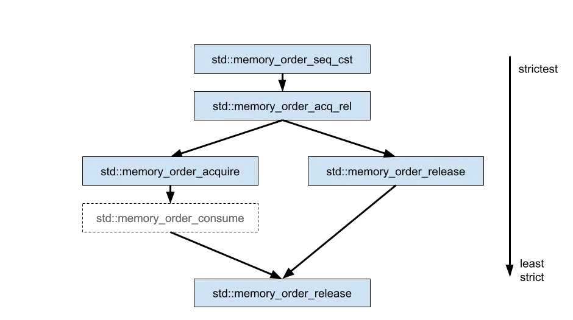

# 🍆 原子变量|CAS操作|内存顺序|C++11

### 原子变量

C++11提供了一个原子类型`std::atomic<T>`，通过这个原子类型管理的内部变量就可以称之为原子变量，我们可以给原子类型指定`bool、char、int、long、指针`等类型作为模板参数（`不支持浮点类型和复合类型`）。

原子指的是一系列不可被CPU上下文交换的机器指令，这些指令组合在一起就形成了原子操作。在多核CPU下，当某个CPU核心开始运行原子操作时，会先暂停其它CPU内核对内存的操作，以保证原子操作不会被其它CPU内核所干扰。

<mark style="color:red;">由于原子操作是通过指令提供的支持，因此它的性能相比锁和消息传递会好很多。相比较于锁而言，原子类型不需要开发者处理加锁和释放锁的问题，同时支持修改，读取等操作，还具备较高的并发性能，几乎所有的语言都支持原子类型。</mark>

可以看出原子类型是无锁类型，但是无锁不代表无需等待，因为原子类型内部使用了`CAS`循环，当大量的冲突发生时，该等待还是得等待！但是总归比锁要好。

C++11内置了整形的原子变量，这样就可以更方便的使用原子变量了。在多线程操作中，使用原子变量之后就不需要再使用互斥量来保护该变量了，用起来更简洁。因为对原子变量进行的操作只能是一个原子操作（`atomic operation`），<mark style="color:red;">原子操作指的是不会被线程调度机制打断的操作(</mark><mark style="color:red;">**read-modify-write**</mark><mark style="color:red;">)，这种操作一旦开始，就一直运行到结束，中间不会有任何的上下文切换。</mark>多线程同时访问共享资源造成数据混乱的原因就是因为CPU的上下文切换导致的，使用原子变量解决了这个问题，因此互斥锁的使用也就不再需要了。

让我们看一些代码来理解这一点。

```c
#include <iostream>
#include <thread>

int main()
{
    int sum = 0;
   
    auto f = [&sum](){
        for(int i = 0; i < 1000000; i++)
        {
            sum += 1;
        }
    };

    std::thread t1(f);
    std::thread t2(f);

    t1.join();
    t2.join();
   
    std::cout << sum << std::endl;

    return 0;
}
```

在此代码中，我们在两个线程 `sum` 上递增，它们之间没有任何同步。我们希望程序输出的结果是 `2000000` ，但是通过编译运行代码，我们会发现结果不尽如意：

```bash
$ g++ --version
g++ (GCC) 11.4.0

$ g++ -dumpmachine
x86_64-pc-cygwin

$ g++ nonatomic.cpp -o app

$ ./app
1508328

$ ./app
1096773

$ ./app
1303703
```

这段代码中对 `sum` 变量的递增操作在多个线程中并不是线程安全的。多个线程同时对 `sum` 进行读取、修改、写入的操作，会引发数据竞争（data race），导致结果不确定。

**线程不安全的递增操作**

在 C++ 中，`sum += 1` 并不是一个原子操作。它实际分为以下几个步骤：

1. 读取 `sum` 的当前值。
2. 将 `sum` 的值加 1。
3. 将新的值写回到 `sum`。

在多线程环境下，如果两个线程同时进行上述操作，就可能出现以下情况：

1. 线程 A 读取 `sum` 的值为 1000。
2. 线程 B 读取 `sum` 的值也为 1000。
3. 线程 A 将值加 1 并写回，`sum` 的值变为 1001。
4. 线程 B 将值加 1 并写回，`sum` 的值也变为 1001。

这样，两个线程各执行了一次加 1 操作，但 `sum` 的值只增加了 1。这就是数据竞争导致的错误。

#### atomic 类成员 <a href="#id-1atomic-lei-cheng-yuan" id="id-1atomic-lei-cheng-yuan"></a>

<mark style="color:red;">不会存储到缓存中，运算完毕后直接给内存了atomic变量无法保护复合类型的数据(类或者结构体)，对于指针类型的atomic变量来说，只有指针</mark><mark style="color:red;">`++/--`</mark><mark style="color:red;">才是原子操作，指针所指的对象(类或者结构体)并不能保证其原子性</mark>\


<figure><figcaption></figcaption></figure>


**类定义**

```c
// 定义于头文件 <atomic>
template< class T >
struct atomic;
```

通过定义可得知：<mark style="color:red;">在使用这个模板类的时候，一定要指定模板类型。</mark>

#### **构造函数**

```c
// 1
atomic() noexcept = default;
// 2
constexpr atomic( T desired ) noexcept;
// 3
atomic( const atomic& ) = delete;
```

* 构造函数1：默认无参构造函数。
* 构造函数2：使用 `desired` 初始化原子变量的值。
* 构造函数3：使用`=delete`显示删除拷贝构造函数, 不允许进行对象之间的拷贝

```c
/**
 * @brief 初始化atomic变量
 */
void test()
{
    atomic<char> c{'a'};
    atomic<int> b;
    atomic_init(&b, 9);
}
```

#### **公共成员函数**

原子类型在类内部重载了`=`操作符，并且<mark style="color:red;">不允许在类的外部使用</mark> <mark style="color:red;"></mark><mark style="color:red;">`=`</mark><mark style="color:red;">进行对象的拷贝。</mark>

```c
T operator=( T desired ) noexcept;
T operator=( T desired ) volatile noexcept;

atomic& operator=( const atomic& ) = delete;
atomic& operator=( const atomic& ) volatile = delete;
```

原子地以 `desired` 替换当前值。按照 `order` 的值影响内存。

```c
void store( T desired, std::memory_order order = std::memory_order_seq_cst ) noexcept;
void store( T desired, std::memory_order order = std::memory_order_seq_cst ) volatile noexcept;
```

* **desired**：存储到原子变量中的值
* **order**：强制的内存顺序

原子地加载并返回原子变量的当前值。按照 `order` 的值影响内存。直接访问原子对象也可以得到原子变量的当前值。

```c
T load( std::memory_order order = std::memory_order_seq_cst ) const noexcept;
T load( std::memory_order order = std::memory_order_seq_cst ) const volatile noexcept;
```

```c
/**
 * @brief 修改atomic变量的值
 */
void test01()
{
    atomic_char cc('b');
    cc = 'd';
    cout << cc << endl;
    cc.store('a');
    cout << cc << endl;

    char ccc = cc.exchange('e');//返回之前的旧值
    cout << cc.load() << endl;
    cout << ccc << endl;
}

```

```c
class Counter {
   public:
    void increment() {
        for (int i = 0; i < 100; ++i) {
            // mtx.lock();
            number++;
            cout << "+++ increment thread id: " << this_thread::get_id()
                 << ", number: " << number << endl;
            // mtx.unlock();
            this_thread::sleep_for(chrono::milliseconds(100));
        }
    }

    void increment1() {
        for (int i = 0; i < 100; ++i) {
            // mtx.lock();
            number++;
            cout << "*** decrement thread id: " << this_thread::get_id()
                 << ", number: " << number << endl;
            // mtx.unlock();
            this_thread::sleep_for(chrono::milliseconds(50));
        }
    }

   private:
    // int number = 0;
    atomic_int number{0};
    // atomic<Base*> base;
    // mutex mtx;
};
```

#### 特化成员函数

* 复合赋值运算符重载，主要包含以下形式：

| 模板类型T为整形 | <p>T operator+= (T val) volatile noexcept;<br>T operator+= (T val) noexcept;<br>T operator-= (T val) volatile noexcept;<br>T operator-= (T val) noexcept;<br>T operator&#x26;= (T val) volatile noexcept;<br>T operator&#x26;= (T val) noexcept;<br>T operator|= (T val) volatile noexcept;<br>T operator|= (T val) noexcept;<br>T operator^= (T val) volatile noexcept;<br>T operator^= (T val) noexcept;</p> |
| :------: | -------------------------------------------------------------------------------------------------------------------------------------------------------------------------------------------------------------------------------------------------------------------------------------------------------------------------------------------------------------------------------------------------------------- |
| 模板类型T为指针 | <p>T operator+= (ptrdiff_t val) volatile noexcept;<br>T operator+= (ptrdiff_t val) noexcept;<br>T operator-= (ptrdiff_t val) volatile noexcept;<br>T operator-= (ptrdiff_t val) noexcept;</p>                                                                                                                                                                                                                  |

* 以上各个 operator 都会有对应的 **fetch\_\*** 操作，详细见下表：

<table><thead><tr><th width="100" align="center">操作符</th><th width="184" align="center">操作符重载函数</th><th width="168" align="center">等级的成员函数</th><th width="84" align="center">整形</th><th width="95" align="center">指针</th><th align="center">其他</th></tr></thead><tbody><tr><td align="center">+</td><td align="center">atomic::operator+=</td><td align="center">atomic::fetch_add</td><td align="center">是</td><td align="center">是</td><td align="center">否</td></tr><tr><td align="center">-</td><td align="center">atomic::operator-=</td><td align="center">atomic::fetch_sub</td><td align="center">是</td><td align="center">是</td><td align="center">否</td></tr><tr><td align="center">&#x26;</td><td align="center">atomic::operator&#x26;=</td><td align="center">atomic::fetch_and</td><td align="center">是</td><td align="center">否</td><td align="center">否</td></tr><tr><td align="center">|</td><td align="center">atomic::operator|=</td><td align="center">atomic::fetch_or</td><td align="center">是</td><td align="center">否</td><td align="center">否</td></tr><tr><td align="center">^</td><td align="center">atomic::operator^=</td><td align="center">atomic::fetch_xor</td><td align="center">是</td><td align="center">否</td><td align="center">否</td></tr></tbody></table>

### CAS(compare and swap)

没有交换操作，CAS 就不完整。交换操作可通过 exchange() 成员函数实现。

```c
#include <iostream>
#include <atomic>

int main() {
    std::atomic<int> atomicInt(10);

    int oldValue = atomicInt.exchange(20);
    std::cout << "Old value: " << oldValue << ", New value: " << atomicInt.load() << std::endl;

    return 0;
}

```

调用 exchange() 会将原子的当前值与所需值互换，并返回原来的值。所有操作均以原子方式完成。

CAS 在swap前增加了一个附加条件，可通过 compare\_exchange\_strong() 和 compare\_exchange\_weak()这两个函数使用。

```c
std::atomic<int> x(0);
int expected = x.load();
int desired = 42;

// If x == expected, x = desired and return true
// Otherwise, expected = x and return false
while(!x.compare_exchange_strong(expected, desired));
```

如上代码所示，该方法将一个期望值与原子变量进行比较。如果它们确实相等，原子变量将被交换，并返回 true。

否则，原子变量的当前值将被加载到expected变量，并返回 false。这种机制允许我们创建一个重试循环，而无需再次显式地读取原子值。

CAS 会失败的原因是与其他线程的争用。在我们对原子进行初始读取以获得预期值后，<mark style="color:red;">我们必须确保其他线程在我们上次读取原子后没有对其进行更改。</mark>假设多个线程都在尝试 CAS，那么重试循环就会一直运行，直到我们的 CAS 比其他线程更快地完成更改。

**使用 `compare_exchange_strong` 的场景：确定性操作**

在需要严格保证操作成功或失败时使用 `compare_exchange_strong`。

```c
#include <iostream>
#include <atomic>
#include <thread>

std::atomic<int> atomicInt(0);

void updateValue() {
    int expected = 0;
    int desired = 1;
    if (atomicInt.compare_exchange_strong(expected, desired)) {
        std::cout << "Value changed to " << desired << std::endl;
    } else {
        std::cout << "Expected " << expected << " but found " << atomicInt.load() << std::endl;
    }
}

int main() {
    std::thread t(updateValue);
    t.join();
    return 0;
}

```

#### 使用 `compare_exchange_weak` 的场景

`compare_exchange_weak` 允许伪失败，即使当前值等于预期值，也可能返回 `false`。这种设计是为了优化在某些架构上的性能，适用于需要反复尝试的场景，如实现自旋锁或无锁数据结构。

**示例 1：自旋锁**

在实现自旋锁时，使用 `compare_exchange_weak` 可以更高效地反复尝试获取锁。

```cpp
#include <iostream>
#include <atomic>
#include <thread>
#include <vector>

std::atomic<bool> lockFlag(false);

void spinlock_acquire() {
    bool expected = false;
    while (!lockFlag.compare_exchange_weak(expected, true)) {
        expected = false;
    }
}

void spinlock_release() {
    lockFlag.store(false);
}

int counter = 0;

void increment() {
    for (int i = 0; i < 1000; ++i) {
        spinlock_acquire();
        ++counter;
        spinlock_release();
    }
}

int main() {
    const int numThreads = 10;
    std::vector<std::thread> threads;

    for (int i = 0; i < numThreads; ++i) {
        threads.push_back(std::thread(increment));
    }

    for (auto& t : threads) {
        t.join();
    }

    std::cout << "Final counter value: " << counter << std::endl;

    return 0;
}

```

**示例 2：无锁队列**

在无锁数据结构（如无锁队列）中，使用 `compare_exchange_weak` 反复尝试更新指针或计数器，优化性能。

```cpp
#include <iostream>
#include <atomic>
#include <thread>
#include <vector>

class Node {
public:
    int value;
    Node* next;

    Node(int val) : value(val), next(nullptr) {}
};

std::atomic<Node*> head(nullptr);

void push(int value) {
    Node* newNode = new Node(value);
    Node* oldHead;
    do {
        oldHead = head.load(std::memory_order_relaxed);
        newNode->next = oldHead;
    } while (!head.compare_exchange_weak(oldHead, newNode, std::memory_order_release, std::memory_order_relaxed));
}

int main() {
    std::vector<std::thread> threads;
    for (int i = 0; i < 10; ++i) {
        threads.push_back(std::thread(push, i));
    }

    for (auto& t : threads) {
        t.join();
    }

    Node* current = head.load();
    while (current) {
        std::cout << current->value << " ";
        Node* tmp = current;
        current = current->next;
        delete tmp;
    }
    std::cout << std::endl;

    return 0;
}

```

#### **Strong vs Weak** <a href="#a3f4" id="a3f4"></a>

std::atomic 为 CAS 提供了强和弱两种选项。

compare\_exchange\_strong() 只有在原子的当前值由于争用而不再是我们所期望的值时，才会失败。

另一方面，compare\_exchange\_weak()允许虚假失败。这意味着，即使预期值等于当前值，它仍可能返回 false。

但为什么我们希望即使当前值等于预期值，CAS 也会失败呢？这是因为在某些平台上，获取独占访问可能代价非常大，但读取原子值却往往代价很小。

因此，弱 CAS <mark style="color:red;">**不会要求独占访问**</mark>，而是执行一定时间的尝试来获取锁（硬件），这可能会超时--类似于网络套接字。

| 步骤                      | 强 (`compare_exchange_strong`)                                                                                                    | 弱 (`compare_exchange_weak`)                                                                                                      |
| ----------------------- | -------------------------------------------------------------------------------------------------------------------------------- | -------------------------------------------------------------------------------------------------------------------------------- |
| 1. 线程读取原子变量并将其与预期值进行比较。 | <p>如果匹配，进行强制尝试以获得独占访问，即等待直到成功。<br><br>如果不匹配，将当前值存储在预期变量中，并立即返回 <code>false</code>。</p>                                           | <p>如果匹配，它将进行一次有时限的尝试以获得独占访问。<br><br>如果不匹配，将当前值存储在预期变量中，并立即返回 <code>false</code>。</p>                                             |
| 2. 获取独占访问               | 等待直到我们获得独占访问。                                                                                                                    | 如果我们的有时限的尝试超时，我们返回 `false`——即使预期值与当前值匹配。                                                                                         |
| 3. 已获得独占访问              | <p>一旦获得独占访问，我们再次将当前值与预期值进行比较，以防它发生了变化。<br><br>如果匹配，执行交换并返回 <code>true</code>。<br><br>否则，将当前值存储在预期变量中，并返回 <code>false</code>。</p> | <p>一旦获得独占访问，我们再次将当前值与预期值进行比较，以防它发生了变化。<br><br>如果匹配，执行交换并返回 <code>true</code>。<br><br>否则，将当前值存储在预期变量中，并返回 <code>false</code>。</p> |

### 内存顺序

* 为什么内存顺序这么重要？

编译器和 CPU 能够对程序指令进行重新排序，通常彼此独立。也就是说，编译器可以重新排序指令，CPU 可以再次重新排序指令。**但是，只有当编译器在两组指令之间没有建立任何依赖关系时，才允许这样做。**

<mark style="color:red;">例如，下面的代码可以重新排序，因为对 x 的赋值和对 y 的赋值之间没有关系。也就是说，编译器或 CPU 可能先分配 y，然后分配 x。但是，这不会改变程序的语义含义。</mark>

```c
int x = 10;
int y = 5;
```

另一方面，下面的代码示例不能重新排序，因为编译器建立了 x 和 y 之间的关系。这里很容易看出，因为 y 取决于 x 的值。

```c
int x = 10;
int y = x + 1;
```

**我们先从一个简单的例子开始，一步步的引出内存顺序的概念**

```c
#include <cassert>
#include <thread>

int data = 0;

void producer() {
  data = 100;  // Write data
}

void consumer() {
  assert(data == 100);
}

int main() {
  std::thread t1(producer);
  std::thread t2(consumer);
  t1.join();
  t2.join();
  return 0;
}
```

上面的多线程示例将无法编译，因为当线程 1 尝试设置数据值而线程 2 尝试读取数据值时，存在明显的数据争用。多个线程对共享资源进行操作时，需要加互斥锁或者使用原子变量，我们使用原子变量作为条件对上面的代码进行改进

```c
#include <atomic>
#include <cassert>
#include <thread>

int data = 0;
std::atomic<bool> ready(false);

void producer() {
  data = 100;
  ready.store(true);  // Set flag
}

void consumer() {
  while (!ready.load())
    ;
  assert(data == 100);
}

int main() {
  std::thread t1(producer);
  std::thread t2(consumer);
  t1.join();
  t2.join();
  return 0;
}

```

上面的代码正确的解决了多线程之间数据竞争的问题，但是如果我替换 `ready.store(true);` 为 `ready.store(true, std::memory_order_relaxed);` 并替换 `while (!ready.load())` 为 `while (!ready.load(std::memory_order_relaxed))` ，会发现数据竞争又产生了。what f\*\*K!

**主要问题在于两个线程中的操作不再有顺序了，编译器或 CPU 可以自由地对两个线程中的指令进行重新排序。**一旦进程 2 确定该标志已设置为 true，它就会尝试读取 的 `data` 值。但是，此时的 `data` 值可能压根并没有修改。大概的样子如下图所示：

<figure><figcaption></figcaption></figure>

上面的示例我们可以看出，在 `memory_order_relaxed` 模式下，两个线程无法就共享变量的操作顺序达成一致。从线程 1 的角度来看，它执行的操作如下：

```c
write(data, 100)
store(ready, true)
```

但是，从线程 2 的角度来看，它看到线程 1 执行的操作顺序是：

```c
store(ready, true)
write(data, 100)
```

如果不就操作共享变量的顺序达成一致，则跨线程对这些变量进行更改是不安全的。

现在我们将`ready.store(true, std::memory_order_relaxed);` 替换为 `ready.store(true, std::memory_order_seq_cst);` 并替换 `while (!ready.load(std::memory_order_relaxed))为` `while (!ready.load(std::memory_order_seq_cst))` .

再次编译会发现，数据竞争被成功解决了，那这背后的原理是什么呢？——Memory Barrier 内存屏障

```bash
Thread 1                  Memory                  Thread 2
---------                 -------                 ---------
  |                          |                          |
  |   write(data, 100)       |                          |
  | -----------------------> |                          |
  |                          |                          |
  |  ================Memory Barrier===================  |
  |   store(ready, true)     |                          |
  | -----------------------> |                          |
  |                          |   load(ready) == true    |                   
  |                          | <----------------------  |
  |  ================Memory Barrier===================  |
  |                          |                          |
  |                          |       read(data)         |
  |                          | <----------------------  |
  |                          |                          |
```

* 线程 1 中 `write(data, 100)` 之后的内存屏障保证了对 `data` 的写操作发生在对 `ready` 的存储之前。
* 线程 2 中 `read(data)` 之前的内存屏障确保了对 `data` 的读取发生在从 `ready` 的加载之后。

#### 内存顺序的类型 <a href="#types-of-memory-order" id="types-of-memory-order"></a>

C++ 提供了不同级别的内存顺序，按如下顺序从最严格到最不严格排列。

<figure><figcaption></figcaption></figure>

* `memory_order_relaxed`， 这是最宽松的规则，它对编译器和CPU不做任何限制，可以乱序
* `memory_order_release` 释放，设定内存屏障(Memory barrier)，保证它之前的操作永远在它之前，但是它后面的操作可能被重排到它前面
* `memory_order_acquire` 获取, 设定内存屏障，保证在它之后的访问永远在它之后，但是它之前的操作却有可能被重排到它后面，往往和Release在不同线程中联合使用
* `memory_order_acq_rel`，它是Acquire 和 Release 的结合，同时拥有它们俩提供的保证。比如你要对一个 atomic 自增 1，同时希望该操作之前和之后的读取或写入操作不会被重新排序&#x20;
* `memory_order_seq_cst` 顺序一致性， memory\_order\_seq\_cst 就像是memory\_order\_acq\_rel的加强版，它不管原子操作是属于读取还是写入的操作，只要某个线程有用到memory\_order\_seq\_cst 的原子操作，线程中该memory\_order\_seq\_cst 操作前的数据操作绝对不会被重新排在该memory\_order\_seq\_cst 操作之后，且该memory\_order\_seq\_cst 操作后的数据操作也绝对不会被重新排在memory\_order\_seq\_cst 操作前。

```c
#include <atomic>
#include <cassert>
#include <iostream>
#include <thread>

int data = 0;
std::atomic<bool> ready(false);

void producer() {
  data = 100;
  ready.store(true, std::memory_order_release);  // Set flag
}

void consumer() {
  while (!ready.load(std::memory_order_acquire))
    ;
  assert(data == 100);
}

int main() {
  std::thread t1(producer);
  std::thread t2(consumer);
  t1.join();
  t2.join();
  return 0;
}

```

上述例子与之前的例子相同，只是这里使用了 `std::memory_order_release` 来处理 `ready.store()`，并且使用了 `memory_order_acquire` 来处理 `ready.load()`。

然而，不同之处在于，这次的内存屏障是在 `ready.store()` 和 `ready.load()` 这一对操作上形成的，<mark style="color:red;">并且这种内存屏障只有在跨线程使用相同的原子变量时才有效。</mark>

假设你有一个变量 `x`，在两个线程中进行修改，你可以在线程 1 中使用 `x.store(std::memory_order_release)`，而在线程 2 中使用 `x.load(std::memory_order_acquire)`，这样你就可以在这个变量上形成两个线程之间的同步点。

顺序一致性模型和释放-获取模型之间的主要区别在于，顺序一致性模型在所有线程之间强制执行全局操作顺序，而释放-获取模型仅在释放和获取操作对之间强制执行操作顺序。

现在，我们可以回顾一下为什么 一开始在没有指定内存顺序时没有报数据竞争的错误。这是因为在 C++ 中，<mark style="color:red;">当没有指定内存顺序时，默认假设使用的是</mark> <mark style="color:red;"></mark><mark style="color:red;">`std::memory_order_seq_cst`</mark><mark style="color:red;">。</mark>由于这是最强的内存模式，因此不会存在数据竞争。

### 原子变量和`std::mutex`之间的效率对比

```c
#include <atomic>
#include <chrono>
#include <iostream>
#include <mutex>
#include <thread>
#include <vector>

const int NUM_THREADS = 8;
const int NUM_ITERATIONS = 1000000;

void atomicIncrement(std::atomic<int>& counter) {
    for (int i = 0; i < NUM_ITERATIONS; ++i) {
        ++counter;
    }
}

void mutexIncrement(int& counter, std::mutex& mtx) {
    for (int i = 0; i < NUM_ITERATIONS; ++i) {
        std::lock_guard<std::mutex> lock(mtx);
        ++counter;
    }
}

int main() {
    // 使用原子变量
    std::atomic<int> atomicCounter(0);
    auto atomicStart = std::chrono::high_resolution_clock::now();

    std::vector<std::thread> atomicThreads;
    for (int i = 0; i < NUM_THREADS; ++i) {
        atomicThreads.emplace_back(atomicIncrement, std::ref(atomicCounter));
    }

    for (auto& t : atomicThreads) {
        t.join();
    }

    auto atomicEnd = std::chrono::high_resolution_clock::now();
    std::chrono::duration<double> atomicDuration = atomicEnd - atomicStart;

    std::cout << "Atomic counter final value: " << atomicCounter << std::endl;
    std::cout << "Atomic duration: " << atomicDuration.count() << " seconds" << std::endl;

    // 使用互斥锁
    int mutexCounter = 0;
    std::mutex mtx;
    auto mutexStart = std::chrono::high_resolution_clock::now();

    std::vector<std::thread> mutexThreads;
    for (int i = 0; i < NUM_THREADS; ++i) {
        mutexThreads.emplace_back(mutexIncrement, std::ref(mutexCounter), std::ref(mtx));
    }

    for (auto& t : mutexThreads) {
        t.join();
    }

    auto mutexEnd = std::chrono::high_resolution_clock::now();
    std::chrono::duration<double> mutexDuration = mutexEnd - mutexStart;

    std::cout << "Mutex counter final value: " << mutexCounter << std::endl;
    std::cout << "Mutex duration: " << mutexDuration.count() << " seconds" << std::endl;

    return 0;
}

```

程序输出结果：

```bash
Atomic counter final value: 8000000
Atomic duration: 0.87419 seconds
Mutex counter final value: 8000000
Mutex duration: 2.82929 seconds
```

### refernce

* [https://subingwen.cn/cpp/atomic/](https://subingwen.cn/cpp/atomic/)
* [https://www.cnblogs.com/chengyuanchun/p/5394843.html](https://www.cnblogs.com/chengyuanchun/p/5394843.html)
* [https://ryonaldteofilo.medium.com/atomics-in-c-compare-and-swap-and-memory-order-part-2-64e127847e00](https://ryonaldteofilo.medium.com/atomics-in-c-compare-and-swap-and-memory-order-part-2-64e127847e00)
* [https://www.freecodecamp.org/news/atomics-and-concurrency-in-cpp/](https://www.freecodecamp.org/news/atomics-and-concurrency-in-cpp/)
