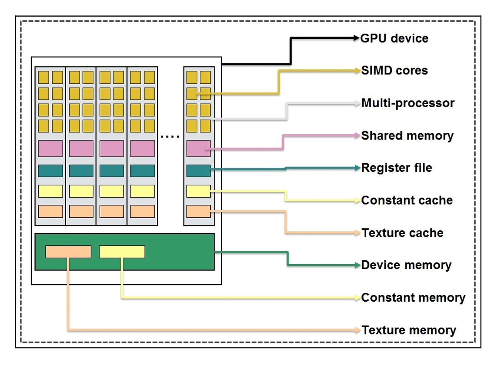

# 🤒 GPU编程模型

### GPU编程模型

软件层面上不管什么计算设备，大部分异构计算都会分成主机代码和设备代码。整体思考过程就是 应用分析、内存资源分配、线程资源分配再到具体核函数的实现。&#x20;

CUDA中线程也可以分成三个层次：线程、线程块和线程网络。&#x20;

#### thread,block,grid

* 线程是CUDA中基本执行单元，由硬件支持、开销很小，每个线程执行相同代码；&#x20;
* 线程块（Block）是若干线程的分组，Block内一个块至多512个线程、或1024个线程（根据不 同的GPU规格），线程块可以是一维、二维或者三维的；&#x20;
* 线程网络（Grid）是若干线程块的网格，Grid是一维和二维的。 线程用ID索引，线程块内用局部ID标记threadID，配合blockDim和blockID可以计算出全局ID，用 于SIMT（`Single Instruction Multiple Thread`单指令多线程）分配任务。

<figure><figcaption></figcaption></figure>

首先需要关注的是具体线程数量的划分，在并行计算部分里也提到数据划分和指令划分的概念， GPU有很多线程，在CUDA里被称为thread，同时我们会把一组thread归为一个block，而block又 会被组织成一个grid。

#### Warp

SM采用的SIMT(Single-Instruction, Multiple-Thread，单指令多线程)架构，warp(线程束)是最基本的执行单元，一个warp包含32个并行thread，这些thread以不同数据资源执行相同的指令。

当一个kernel被执行时，grid中的线程块被分配到SM上，一个线程块的thread只能在一个SM上调度，SM一般可以调度多个线程块，大量的thread可能被分到不同的SM上。每个thread拥有它自己的程序计数器和状态寄存器，并且用该线程自己的数据执行指令，这就是所谓的Single Instruction Multiple Thread(SIMT)。

一个CUDA core可以执行一个thread，一个SM的CUDA core会分成几个warp（即CUDA core在SM中分组)，由warp scheduler负责调度。尽管warp中的线程从同一程序地址，但可能具有不同的行为，比如不同的分支结构，因为GPU规定warp中所有线程在同一周期执行相同的指令，warp发散会导致性能下降。一个SM同时并发的warp是有限的，因为资源限制，SM要为每个线程块分配共享内存，而也要为每个线程束中的线程分配独立的寄存器，所以SM的配置会影响其所支持的线程块和warp并发数量。每个block的warp数量可以由下面的公式计算获得：

$$
WarpPerBlock=ceil(\frac{ThreadsPerBlock}{WarpSize})
$$

一个warp中的线程必然在同一个block中，如果block所含线程数目不是warp大小的整数倍，那么多出的那些thread所在的warp中，会剩余一些inactive的thread，需要注意的是，即使这部分thread是inactive的，也会消耗SM资源。由于warp的大小一般为32，所以block所含的thread的大小一般要设置为32的倍数。

### 软件和硬件的对应关系

GPU在管理线程(thread)的时候是以block(线程块)为单元调度到SM上执行。每个block中以warp(一般32个线程或64线 程)作为一次执行的单位(真正的同时执行)。

1. 一个 GPU 包含多个 Streaming Multiprocessor ，而每个 Streaming Multiprocessor 又包含多个 core 。 Streaming Multiprocessors 支持并发执行多达几百的 thread 。&#x20;
2. 一个 thread block 只能调度到一个 Streaming Multiprocessor 上运行，直到 thread block 运行完毕。一个 Streaming Multiprocessor 可以同时运行多个thread block （因为有多个core）。&#x20;

通俗点讲：stream multiprocessor(SM)是一块硬件，包含了固定数量的运算单元，寄存器和缓存。 写cuda kernel的时候，跟SM对应的概念是block，每一个block会被调度到某个SM执行，一个SM可以执行多个block。 你的cuda程序就是很多的blocks(一般来说越多越好)均匀的喂给这80个SM来调度执行。具体每个block喂给哪个SM你没 法控制。&#x20;

不同的GPU规格参数也不一样，比如 Fermi 架构（2010年的比较老）:&#x20;

* 每一个SM上最多同时执行8个block。(不管block大小)&#x20;
* 每一个SM上最多同时执行48个warp。&#x20;
* 每一个SM上最多同时执行48\*32=1,536个线程。&#x20;

当warp访问内存的时候，processor(处理器)会做context switch(上下文切换)，让其他warp使用硬件资源。因为是硬件来做，所以速度非常快。

<figure><figcaption></figcaption></figure>

### CUDA内存模型

#### 寄存器

寄存器变量对于每个线程来说都是私有的，一个核函数通常使用寄存器来保存需要频 繁访问的线程私有变量。寄存器变量与核函数的生命周期相同。一旦核函数执行完毕，就 不能对寄存器变量进行访问了。

在核 函数中使用较少的寄存器将使在SM上有更多的常驻线程块。每个SM上并发线程块越多， 使用率和性能就越高。

#### 共享内存

在核函数中使用如下修饰符修饰的变量存放在共享内存中：

```c
__share__
```

因为共享内存是片上内存，所以与本地内存或全局内存相比，它具有更高的带宽和更 低的延迟。它的使用类似于CPU一级缓存，但它是可编程的。&#x20;

每一个SM都有一定数量的由线程块分配的共享内存。因此，必须非常小心不要过度使用共享内存，否则将在不经意间限制活跃线程束的数量。

共享内存在核函数的范围内声明，其生命周期伴随着整个线程块。当一个线程块执行 结束后，其分配的共享内存将被释放并重新分配给其他线程块。

共享内存是线程之间相互通信的基本方式。一个块内的线程通过使用共享内存中的数 据可以相互合作。访问共享内存必须同步使用如下调用：

```c
void __syncthreads
```

该函数设立了一个执行障碍点，即同一个线程块中的所有线程必须在其他线程被允许 执行前达到该处。为线程块里所有线程设立障碍点，这样可以避免潜在的数据冲突。


`__syncthreads`通过频繁强制SM到空闲状态来影响性能。


#### 常量内存

常量内存驻留在设备内存中，并在每个SM专用的常量缓存中缓存。常量变量用如下 修饰符来修饰：

```c
__constant__
```

常量内存是静态声明的，并对同一编译单元中的所有核函数可见。常量内存在主机端使用下面的函数来初始化：    &#x20;

```c
cudaError_t cudaMemcpyToSymbol(const void* symbol, const void* src, size_t count);
```

这个函数将count个字节从src指向的内存复制到symbol指向的内存中，这个变量存放 在设备的全局内存或常量内存中。在大多数情况下这个函数是同步的。&#x20;

线程束中的所有线程从相同的内存地址中读取数据时，常量内存表现最好。举个例子，数学公式中的系数就是一个很好的使用常量内存的例子，因为一个线程束中所有的线 程使用相同的系数来对不同数据进行相同的计算。如果线程束里每个线程都从不同的地址空间读取数据，并且只读一次，那么常量内存中就不是最佳选择，因为每从一个常量内存中读取一次数据，都会广播给线程束里的所有线程。

#### 纹理内存

纹理内存驻留在设备内存中，并在每个SM的只读缓存中缓存。纹理内存是一种通过 指定的只读缓存访问的全局内存。只读缓存包括硬件滤波的支持，它可以将浮点插入作为 读过程的一部分来执行。纹理内存是对二维空间局部性的优化，所以线程束里使用纹理内 存访问二维数据的线程可以达到最优性能。对于一些应用程序来说，这是理想的内存，并 由于缓存和滤波硬件的支持所以有较好的性能优势。然而对于另一些应用程序来说，与全局内存相比，使用纹理内存更慢。

<figure><figcaption></figcaption></figure>

### 网格（Grid）、线程块（Block）和线程（Thread）的组织关系

#### 格（Grid）、线程块（Block）和线程（Thread）的组织关系&#x20;

CUDA的软件架构由网格（Grid）、线程块（Block）和线程（Thread）组成，相当于把GPU上的计算单元分为若干 （2\~3）个网格，每个网格内包含若干（65535）个线程块，每个线程块包含若干（512/1024）个线程，三者的关系如 下图：

<figure><figcaption></figcaption></figure>

Thread，block，grid是CUDA编程上的概念，为了方便程序员软件设计，组织线程。&#x20;

* thread：一个CUDA的并行程序会被以许多个threads来执行。&#x20;
* block：数个threads会被群组成一个block，同一个block中的threads可以同步，也可以通过shared memory通信。
* grid：多个blocks则会再构成grid。

### 网格（Grid）、线程块（Block）和线程（Thread）的最大数量

CUDA中可以创建的网格数量跟GPU的计算能力有关，可创建的Grid、Block和Thread的最大数量参看以下表格：

<figure><figcaption></figcaption></figure>

### CUDA为什么要分线程块和线程网格

知乎：[https://www.zhihu.com/question/35361192/answer/3271182561](https://www.zhihu.com/question/35361192/answer/3271182561)

### CUDA内核函数和配置&#x20;

主机调用设备代码的唯一接口就是Kernel函数，使用限定符:`__global__`。&#x20;

调用内核函数需要在内核函数名后添加`<<<>>>`指定内核函数配置， `<<<>>>`运算符完整的执行配置参数形式是`<<<Dg, Db, Ns, S>>>`&#x20;

* 参数Dg用于定义整个grid的维度和尺寸，即一个grid有多少个block。为dim3类型。Dim3 Dg(Dg.x, Dg.y, 1)表示grid 中每行有Dg.x个block，每列有Dg.y个block，第三维恒为1(目前一个核函数只有一个grid)。整个grid中共有Dg.x\*Dg. y个block，其中Dg.x和Dg.y最大值为65535。
* 参数Db用于定义一个block的维度和尺寸，即一个block有多少个thread。为dim3类型。Dim3 Db(Db.x, Db.y, Db.z) 表示整个block中每行有Db.x个thread，每列有Db.y个thread，高度为Db.z。Db.x和Db.y最大值为512，Db.z最大值 为62。 一个block中共有Db.x\*Db.y\*Db.z个thread。计算能力为1.0,1.1的硬件该乘积的最大值为768，计算能力为 1.2,1.3的硬件支持的最大值为1024。
* 参数Ns是一个可选参数，用于设置每个block除了静态分配的shared Memory以外，最多能动态分配的shared memory大小，单位为byte。不需要动态分配时该值为0或省略不写。
* 参数S是一个cudaStream\_t类型的可选参数，初始值为零，表示该核函数处在哪个流之中。

### CUDA限定符

函数限定符：

<figure><figcaption></figcaption></figure>

变量限定符：

<figure><figcaption></figcaption></figure>

### CUDA运行时API&#x20;

这里介绍最基础的内存管理函数，其他详见官网

#### cudaMemcpy

```c
 __host__ cudaError_t cudaMemcpy( void* dst, const void* src, size_t count, cudaMemcpyKind kind )
```

用于在主机和设备之间拷贝数据，其中cudaMemcpyKind枚举类型常用有 cudaMemcpyHostToDevice表示把主机数据拷贝到设备内存以及 cudaMemcpyDeviceToHost 把设备内存数据拷贝到主机上。

#### cudaMalloc

```c
 __host__ __device__ cudaError_t cudaMalloc( void** devPtr, size_t size )
```

在设备上分配动态内存，两个限定符表示既可以在主机上也可以在设备上执行或者调用。

#### cudaFree

```c
 __host__ __device__ cudaError_t cudaFree( void* devPtr )
```

释放回收在设备上分配动态内存，两个限定符表示既可以在主机上也可以在设备上执行或者调用。

### 线程索引的计算公式

一个Grid可以包含多个Blocks，Blocks的组织方式可以是一维的，二维或者三维的。block包含多个Threads，这些 Threads的组织方式也可以是一维，二维或者三维的。 CUDA中每一个线程都有一个唯一的标识ID(ThreadIdx)，这个ID随着Grid和Block的划分方式的不同而变化，这里给出 Grid和Block不同划分方式下线程索引ID的计算公式。&#x20;

* threadIdx是一个uint3类型，表示一个线程的索引。&#x20;
* blockIdx是一个uint3类型，表示一个线程块的索引，一个线程块中通常有多个线程。&#x20;
* blockDim是一个dim3类型，表示线程块的大小。&#x20;
* gridDim是一个dim3类型，表示网格的大小，一个网格中通常有多个线程块。&#x20;

下面这张图比较清晰的表示的几个概念的关系：

<figure><figcaption></figcaption></figure>

#### 示例程序

```c
#include <cuda_runtime.h>
#include <stdio.h>


__global__ void print_idx_kernel(){
    printf("block idx: (%3d, %3d, %3d), thread idx: (%3d, %3d, %3d)\n",
         blockIdx.z, blockIdx.y, blockIdx.x,
         threadIdx.z, threadIdx.y, threadIdx.x);
}

__global__ void print_dim_kernel(){
    printf("grid dimension: (%3d, %3d, %3d), block dimension: (%3d, %3d, %3d)\n",
         gridDim.z, gridDim.y, gridDim.x,
         blockDim.z, blockDim.y, blockDim.x);
}

// 在block空间中打印每个thread一维连续的线性索引
__global__ void print_thread_idx_per_block_kernel(){
    int index = threadIdx.z * blockDim.x * blockDim.y + \
              threadIdx.y * blockDim.x + \
              threadIdx.x;

    printf("block idx: (%3d, %3d, %3d), thread idx: %3d\n",
         blockIdx.z, blockIdx.y, blockIdx.x,
         index);
}

// 在grid空间中打印每个thread一维连续的线性索引
__global__ void print_thread_idx_per_grid_kernel(){
    int bSize  = blockDim.z * blockDim.y * blockDim.x;

    int bIndex = blockIdx.z * gridDim.x * gridDim.y + \
               blockIdx.y * gridDim.x + \
               blockIdx.x;

    int tIndex = threadIdx.z * blockDim.x * blockDim.y + \
               threadIdx.y * blockDim.x + \
               threadIdx.x;

    int index  = bIndex * bSize + tIndex;//从这里开始理解

    printf("block idx: %3d, thread idx in block: %3d, thread idx: %3d\n", 
         bIndex, tIndex, index);
}


__global__ void print_cord_kernel(){
    int index = threadIdx.z * blockDim.x * blockDim.y + \
              threadIdx.y * blockDim.x + \
              threadIdx.x;

    int x  = blockIdx.x * blockDim.x + threadIdx.x;
    int y  = blockIdx.y * blockDim.y + threadIdx.y;

    printf("block idx: (%3d, %3d, %3d), thread idx: %3d, cord: (%3d, %3d)\n",
         blockIdx.z, blockIdx.y, blockIdx.x,
         index, x, y);
}

void print_one_dim(){
    int inputSize = 8;//1*8大小的向量
    int blockDim = 4;
    int gridDim = inputSize / blockDim;

    dim3 block(blockDim);
    dim3 grid(gridDim);

    // print_idx_kernel<<<grid, block>>>();
    // print_dim_kernel<<<grid, block>>>();
    // print_thread_idx_per_block_kernel<<<grid, block>>>();
    print_thread_idx_per_grid_kernel<<<grid, block>>>();

    cudaDeviceSynchronize();
}

void print_two_dim(){
    int inputWidth = 4;//4*4大小的矩阵
    int blockDim = 2;
    int gridDim = inputWidth / blockDim;

    dim3 block(blockDim, blockDim);
    dim3 grid(gridDim, gridDim);

    // print_idx_kernel<<<grid, block>>>();
    // print_dim_kernel<<<grid, block>>>();
    // print_thread_idx_per_block_kernel<<<grid, block>>>();
    print_thread_idx_per_grid_kernel<<<grid, block>>>();

    cudaDeviceSynchronize();
}

void print_cord(){
    int inputWidth = 4;//一张4*4大小的图片

    int blockDim = 2;
    int gridDim = inputWidth / blockDim;

    dim3 block(blockDim, blockDim);
    dim3 grid(gridDim, gridDim);

    print_cord_kernel<<<grid, block>>>();

    cudaDeviceSynchronize();
}

int main() {
    // print_one_dim();
    // print_two_dim();
    print_cord();
    return 0;
}

```

这段程序分别以一维的向量(`blockDim=4, gridDim=2`)和二维的矩阵(`blockDim=(2, 2),  gridDim=(2, 2)`)为例子分别查看程序输出的索引信息和维度信息。

#### 程序输出结果分析

1. `print_idx_kernel()`

```c
__global__ void print_idx_kernel(){
    printf("block idx: (%3d, %3d, %3d), thread idx: (%3d, %3d, %3d)\n",
         blockIdx.z, blockIdx.y, blockIdx.x,
         threadIdx.z, threadIdx.y, threadIdx.x);
}
```

<figure><figcaption></figcaption></figure>

* 一维输出结果：

```bash
block idx: (  0,   0,   1), thread idx: (  0,   0,   0)
block idx: (  0,   0,   1), thread idx: (  0,   0,   1)
block idx: (  0,   0,   1), thread idx: (  0,   0,   2)
block idx: (  0,   0,   1), thread idx: (  0,   0,   3)
block idx: (  0,   0,   0), thread idx: (  0,   0,   0)
block idx: (  0,   0,   0), thread idx: (  0,   0,   1)
block idx: (  0,   0,   0), thread idx: (  0,   0,   2)
block idx: (  0,   0,   0), thread idx: (  0,   0,   3)
```

* 二维输出结果：

```bash
block idx: (  0,   1,   0), thread idx: (  0,   0,   0)
block idx: (  0,   1,   0), thread idx: (  0,   0,   1)
block idx: (  0,   1,   0), thread idx: (  0,   1,   0)
block idx: (  0,   1,   0), thread idx: (  0,   1,   1)
block idx: (  0,   1,   1), thread idx: (  0,   0,   0)
block idx: (  0,   1,   1), thread idx: (  0,   0,   1)
block idx: (  0,   1,   1), thread idx: (  0,   1,   0)
block idx: (  0,   1,   1), thread idx: (  0,   1,   1)
block idx: (  0,   0,   1), thread idx: (  0,   0,   0)
block idx: (  0,   0,   1), thread idx: (  0,   0,   1)
block idx: (  0,   0,   1), thread idx: (  0,   1,   0)
block idx: (  0,   0,   1), thread idx: (  0,   1,   1)
block idx: (  0,   0,   0), thread idx: (  0,   0,   0)
block idx: (  0,   0,   0), thread idx: (  0,   0,   1)
block idx: (  0,   0,   0), thread idx: (  0,   1,   0)
block idx: (  0,   0,   0), thread idx: (  0,   1,   1)
```

2. `print_dim_kernel()`

```c
__global__ void print_dim_kernel(){
    printf("grid dimension: (%3d, %3d, %3d), block dimension: (%3d, %3d, %3d)\n",
         gridDim.z, gridDim.y, gridDim.x,
         blockDim.z, blockDim.y, blockDim.x);
}
```

* 一维输出结果：

```bash
grid dimension: (  1,   1,   2), block dimension: (  1,   1,   4)
grid dimension: (  1,   1,   2), block dimension: (  1,   1,   4)
grid dimension: (  1,   1,   2), block dimension: (  1,   1,   4)
grid dimension: (  1,   1,   2), block dimension: (  1,   1,   4)
grid dimension: (  1,   1,   2), block dimension: (  1,   1,   4)
grid dimension: (  1,   1,   2), block dimension: (  1,   1,   4)
grid dimension: (  1,   1,   2), block dimension: (  1,   1,   4)
grid dimension: (  1,   1,   2), block dimension: (  1,   1,   4)
```

* 二维输出结果：

```bash
grid dimension: (  1,   2,   2), block dimension: (  1,   2,   2)
grid dimension: (  1,   2,   2), block dimension: (  1,   2,   2)
grid dimension: (  1,   2,   2), block dimension: (  1,   2,   2)
grid dimension: (  1,   2,   2), block dimension: (  1,   2,   2)
grid dimension: (  1,   2,   2), block dimension: (  1,   2,   2)
grid dimension: (  1,   2,   2), block dimension: (  1,   2,   2)
grid dimension: (  1,   2,   2), block dimension: (  1,   2,   2)
grid dimension: (  1,   2,   2), block dimension: (  1,   2,   2)
grid dimension: (  1,   2,   2), block dimension: (  1,   2,   2)
grid dimension: (  1,   2,   2), block dimension: (  1,   2,   2)
grid dimension: (  1,   2,   2), block dimension: (  1,   2,   2)
grid dimension: (  1,   2,   2), block dimension: (  1,   2,   2)
grid dimension: (  1,   2,   2), block dimension: (  1,   2,   2)
grid dimension: (  1,   2,   2), block dimension: (  1,   2,   2)
grid dimension: (  1,   2,   2), block dimension: (  1,   2,   2)
grid dimension: (  1,   2,   2), block dimension: (  1,   2,   2)
```

3. `print_thread_idx_per_block_kernel()`

```c
// 在block空间中打印每个thread一维连续的线性索引
__global__ void print_thread_idx_per_block_kernel(){
    int index = threadIdx.z * blockDim.x * blockDim.y + \
              threadIdx.y * blockDim.x + \
              threadIdx.x;

    printf("block idx: (%3d, %3d, %3d), thread idx: %3d\n",
         blockIdx.z, blockIdx.y, blockIdx.x,
         index);
}
```

<figure><figcaption></figcaption></figure>

* 一维输出结果：

```bash
block idx: (  0,   0,   0), thread idx:   0
block idx: (  0,   0,   0), thread idx:   1
block idx: (  0,   0,   0), thread idx:   2
block idx: (  0,   0,   0), thread idx:   3
block idx: (  0,   0,   1), thread idx:   0
block idx: (  0,   0,   1), thread idx:   1
block idx: (  0,   0,   1), thread idx:   2
block idx: (  0,   0,   1), thread idx:   3
```

* 二维输出结果：

```bash
block idx: (  0,   1,   0), thread idx:   0
block idx: (  0,   1,   0), thread idx:   1
block idx: (  0,   1,   0), thread idx:   2
block idx: (  0,   1,   0), thread idx:   3
block idx: (  0,   1,   1), thread idx:   0
block idx: (  0,   1,   1), thread idx:   1
block idx: (  0,   1,   1), thread idx:   2
block idx: (  0,   1,   1), thread idx:   3
block idx: (  0,   0,   1), thread idx:   0
block idx: (  0,   0,   1), thread idx:   1
block idx: (  0,   0,   1), thread idx:   2
block idx: (  0,   0,   1), thread idx:   3
block idx: (  0,   0,   0), thread idx:   0
block idx: (  0,   0,   0), thread idx:   1
block idx: (  0,   0,   0), thread idx:   2
block idx: (  0,   0,   0), thread idx:   3
```

4. `print_thread_idx_per_grid_kernel()`

<pre class="language-c"><code class="lang-c">// 在grid空间中打印每个thread一维连续的线性索引
__global__ void print_thread_idx_per_grid_kernel(){
<strong>    int bSize  = blockDim.z * blockDim.y * blockDim.x;
</strong>
    int bIndex = blockIdx.z * gridDim.x * gridDim.y + \
               blockIdx.y * gridDim.x + \
               blockIdx.x;

    int tIndex = threadIdx.z * blockDim.x * blockDim.y + \
               threadIdx.y * blockDim.x + \
               threadIdx.x;

    int index  = bIndex * bSize + tIndex;//从这里开始理解

    printf("block idx: %3d, thread idx in block: %3d, thread idx: %3d\n", 
         bIndex, tIndex, index);
}
</code></pre>


使用CUDA 在图像中进行寻找坐标的时候推荐这么使用


<figure><figcaption></figcaption></figure>

* 一维输出结果：

```bash
block idx:   0, thread idx in block:   0, thread idx:   0
block idx:   0, thread idx in block:   1, thread idx:   1
block idx:   0, thread idx in block:   2, thread idx:   2
block idx:   0, thread idx in block:   3, thread idx:   3
block idx:   1, thread idx in block:   0, thread idx:   4
block idx:   1, thread idx in block:   1, thread idx:   5
block idx:   1, thread idx in block:   2, thread idx:   6
block idx:   1, thread idx in block:   3, thread idx:   7
```

* 二维输出结果：

```bash
block idx:   3, thread idx in block:   0, thread idx:  12
block idx:   3, thread idx in block:   1, thread idx:  13
block idx:   3, thread idx in block:   2, thread idx:  14
block idx:   3, thread idx in block:   3, thread idx:  15
block idx:   2, thread idx in block:   0, thread idx:   8
block idx:   2, thread idx in block:   1, thread idx:   9
block idx:   2, thread idx in block:   2, thread idx:  10
block idx:   2, thread idx in block:   3, thread idx:  11
block idx:   1, thread idx in block:   0, thread idx:   4
block idx:   1, thread idx in block:   1, thread idx:   5
block idx:   1, thread idx in block:   2, thread idx:   6
block idx:   1, thread idx in block:   3, thread idx:   7
block idx:   0, thread idx in block:   0, thread idx:   0
block idx:   0, thread idx in block:   1, thread idx:   1
block idx:   0, thread idx in block:   2, thread idx:   2
block idx:   0, thread idx in block:   3, thread idx:   3
```

5. `print_cord_kernel()`

```bash
__global__ void print_cord_kernel(){
    int index = threadIdx.z * blockDim.x * blockDim.y + \
              threadIdx.y * blockDim.x + \
              threadIdx.x;

    int x  = blockIdx.x * blockDim.x + threadIdx.x;
    int y  = blockIdx.y * blockDim.y + threadIdx.y;

    printf("block idx: (%3d, %3d, %3d), thread idx: %3d, cord: (%3d, %3d)\n",
         blockIdx.z, blockIdx.y, blockIdx.x,
         index, x, y);
}
```

* 输出结果：

```bash
block idx: (  0,   1,   0), thread idx:   0, cord: (  0,   2)
block idx: (  0,   1,   0), thread idx:   1, cord: (  1,   2)
block idx: (  0,   1,   0), thread idx:   2, cord: (  0,   3)
block idx: (  0,   1,   0), thread idx:   3, cord: (  1,   3)
block idx: (  0,   1,   1), thread idx:   0, cord: (  2,   2)
block idx: (  0,   1,   1), thread idx:   1, cord: (  3,   2)
block idx: (  0,   1,   1), thread idx:   2, cord: (  2,   3)
block idx: (  0,   1,   1), thread idx:   3, cord: (  3,   3)
block idx: (  0,   0,   1), thread idx:   0, cord: (  2,   0)
block idx: (  0,   0,   1), thread idx:   1, cord: (  3,   0)
block idx: (  0,   0,   1), thread idx:   2, cord: (  2,   1)
block idx: (  0,   0,   1), thread idx:   3, cord: (  3,   1)
block idx: (  0,   0,   0), thread idx:   0, cord: (  0,   0)
block idx: (  0,   0,   0), thread idx:   1, cord: (  1,   0)
block idx: (  0,   0,   0), thread idx:   2, cord: (  0,   1)
block idx: (  0,   0,   0), thread idx:   3, cord: (  1,   1)
```


**CUDA中的几种同步机制**

#### 1. `__syncthreads()`

这是CUDA内核（kernel）中使用的一个内置函数，用于确保同一个线程块（thread block）内的所有线程完成它们的执行，然后才能继续执行后续的指令。这个函数只能在内核代码中使用，不能在主机代码（CPU上运行的代码）中使用。

* **作用域**：仅限于内核内部，用于同步同一个线程块内的线程。
* **使用场景**：当内核中的多个线程需要协作完成某个任务，并且所有线程必须等待彼此完成才能继续执行下一步时使用。
* **性能影响**：过度使用`__syncthreads()`可能导致性能下降，因为它强制所有线程同步，即使有些线程可能已经完成了它们的工作。

#### 2. `cudaDeviceSynchronize()`

这是一个在主机代码中调用的函数，用于确保设备（GPU）上所有先前排队的工作都已完成。如果`cudaDeviceSynchronize()`被调用，它会等待所有先前排队的内核执行完成，所有先前启动的内存传输完成，然后才返回。

* **作用域**：整个设备上的所有流（stream）。
* **使用场景**：当你需要确保所有并行工作都已完成，以便进行一致性检查或在继续执行之前确保数据是最新的。
* **性能影响**：它可能会导致不必要的同步，从而降低性能，因为它不区分不同流中的工作。

#### 3. `cudaStreamSynchronize()`

这个函数用于同步特定的流（stream）。CUDA流是CUDA编程中的一个概念，允许开发者并行地执行一系列操作。`cudaStreamSynchronize()`确保在指定流中的所有先前排队的工作都已完成。

* **作用域**：仅限于特定的流。
* **使用场景**：当你在不同的流中并行执行多个任务，并且需要在特定流中的工作完成后再进行某些操作时使用。
* **性能影响**：相比`cudaDeviceSynchronize()`，它提供了更好的性能，因为它只同步特定流中的工作，而不是整个设备上的所有工作。


### reference

* [https://zhuanlan.zhihu.com/p/123170285](https://zhuanlan.zhihu.com/p/123170285)
* [https://www.cnblogs.com/dama116/p/6909629.html](https://www.cnblogs.com/dama116/p/6909629.html)
