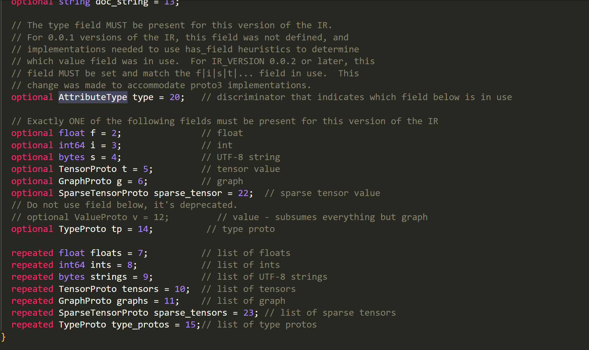
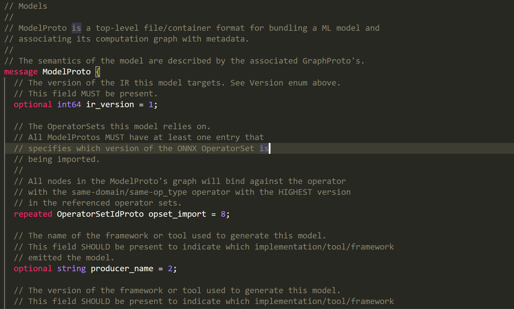

# 😘 ONNX IR(Intermediate Representation)

### ONNX部分

ONNX是一种神经网络的格式，采用Protobuf二进制形式进行序列化模型。 Protobuf会根据用于定义的数据结构来进行序列化存储 同理，我们可以根据官方提供的数据结构信息，去修改或者创建onnx。

<figure><figcaption></figcaption></figure>

onnx的各类proto的定义需要看官方文档([https://github.com/onnx/onnx/tree/main](https://github.com/onnx/onnx/tree/main)) 。这里面的`onnx/onnx.in.proto`定义了所有onnx的Proto。有关onnx的IR(`intermediate representation`)信息，看这里([https://github.com/onnx/onnx/blob/main/docs/IR.md](https://github.com/onnx/onnx/blob/main/docs/IR.md))

### 理解onnx中的组织结构

* `ModelProto` (描述的是整个模型的信息)
* `GraphProto` (描述的是整个网络的信息)
* `NodeProto` (描述的是各个计算节点，比如`conv`, `linear`)
* `TensorProto` (描述的是`tensor`的信息，主要包括权重)
* `ValueInfoProto` (描述的是`input/output`信息)
* `AttributeProto` (描述的是`node`节点的各种属性信息)

### onnx中的ValueInfoProto

一般用来定义网络的`input/output` ，会根据`input/output`的`type`来附加属性

​

<figure><figcaption></figcaption></figure>

<figure><figcaption></figcaption></figure>

### onnx中的TensorProto

​

<figure><figcaption></figcaption></figure>

<figure><figcaption></figcaption></figure>

<figure><figcaption></figcaption></figure>

一般用来定义一个权重，比如conv的w和b ，`dims`是`repeated`类型，意味着是数组，`raw_data`是`bytes`类型。

### onnx中的NodeProto

<figure><figcaption></figcaption></figure>

一般用来定义一个计算节点，比如`conv`, `linear` ，`input`是`repeated`类型，意味着是数组，output是repeated类型，意味着是数组，`attribute`有一个自己的Proto，`op_type`需要严格根据`onnx`所提供的`Operators`写。

#### onnx中的AttributeProto

​

<figure><figcaption></figcaption></figure>

<figure><figcaption></figcaption></figure>

一般用来定义一个`node`的属性。比如说`kernel size`，比较常见的方式就是把`(key, value)`传入`Proto`，之后 `name = key` ,`i = value` 。

#### onnx中的GraphProto

<figure><figcaption></figcaption></figure>

一般用来定义一个网络。包括 ：`input/output` ，`initializer`，`initializer`: 在onnx中一般表示权重信息。 `node`是`repeated`，所以是数组，`initializer`是`repeated`，所以是数组，`input/output`是`repeated`，所以是数组。

#### onnx中的ModelProto

<figure><figcaption></figcaption></figure>

一般用来定义模型的全局信息，比如`opset` ，`graph`并不是`repeated`，所以一个`model`对应一个`graph`

🥰onnx提供了一些很方便的`api`来创建`onnx` ：`onnx.helper.make_tensor` `onnx.helper.make_tensor_value_info` ，`onnx.helper.make_attribute` `onnx.helper.make_node` ，`onnx.helper.make_graph` ，`onnx.helper.make_model`

虽然onnx官方提供了而一些python API来修改onnx，但是推荐大家使用`TensorRT`下的`onnxsurgeon`，更加方便快捷。
