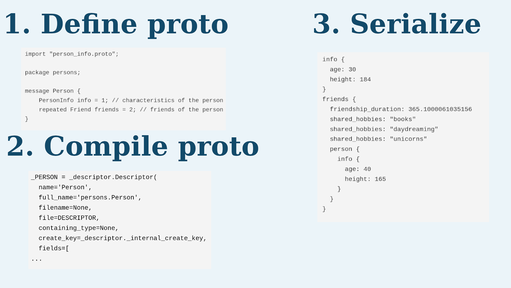
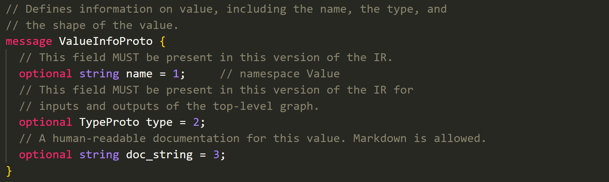
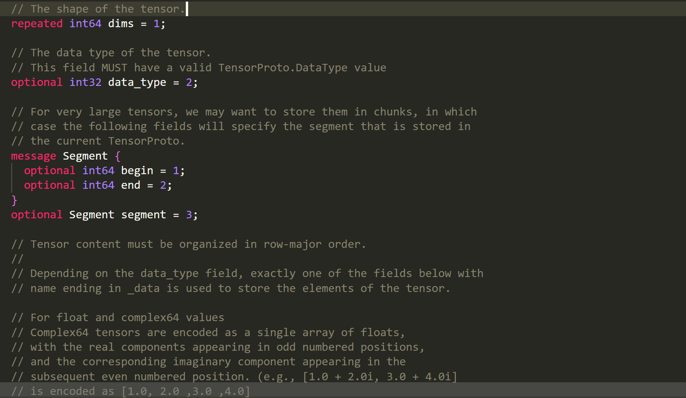
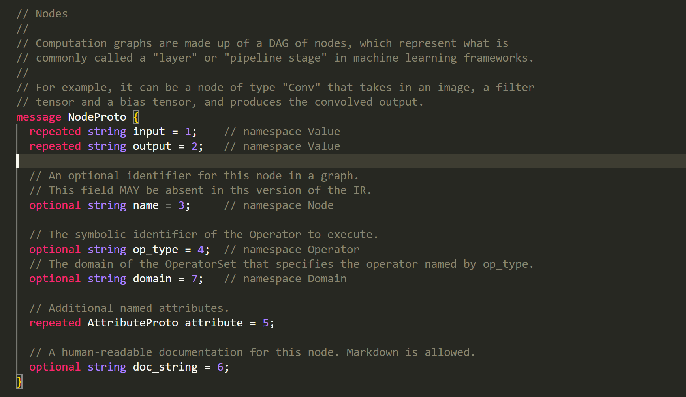

# 😉 ONNX中的给类Proto

### **中间表示 —— ONNX**

在介绍 ONNX 之前，我们先从本质上来认识一下神经网络的结构。神经网络实际上只是描述了数据计算的过程，其结构可以用计算图表示。比如 a+b 可以用下面的计算图来表示：

<mark style="color:red;">为了加速计算，一些框架会使用对神经网络“先编译，后执行”的静态图来描述网络。静态图的缺点是难以描述控制流（比如 if-else 分支语句和 for 循环语句）</mark>，直接对其引入控制语句会导致产生不同的计算图。比如循环执行 n 次 a=a+b，对于不同的 n，会生成不同的计算图：

ONNX是一种神经网络的格式，采用Protobuf二进制形式进行序列化模型。 Protobuf会根据用于定义的数据结构来进行序列化存储 同理，我们可以根据官方提供的数据结构信息，去修改或者创建onnx。

<figure><figcaption></figcaption></figure>

onnx的各类proto的定义需要看官方文档([https://github.com/onnx/onnx/tree/main](https://github.com/onnx/onnx/tree/main)) 。这里面的`onnx/onnx.in.proto`定义了所有onnx的Proto。有关onnx的IR(`intermediate representation`)信息，看这里([https://github.com/onnx/onnx/blob/main/docs/IR.md](https://github.com/onnx/onnx/blob/main/docs/IR.md))

#### 理解onnx中的组织结构

* `ModelProto`(描述的是整个模型的信息)
* `GraphProto`(描述的是整个网络的信息)
* `NodeProto` (描述的是各个计算节点，比如conv, linear)
* `TensorProto` (描述的是tensor的信息，主要包括权重)
* `ValueInfoProto` (描述的是input/output信息)
* `AttributeProto` (描述的是node节点的各种属性信息)

#### onnx中的ValueInfoProto

一般用来定义网络的`input/output` ，会根据`input/output`的`type`来附加属性

<figure><figcaption></figcaption></figure>

<figure><figcaption></figcaption></figure>

#### onnx中的TensorProto

<figure><figcaption></figcaption></figure>

<figure><figcaption></figcaption></figure>

<figure><figcaption></figcaption></figure>

一般用来定义一个权重，比如`conv`的`w`和`b` ，`dims`是`repeated`类型，意味着是数组，`raw_data`是`bytes`类型。

#### onnx中的NodeProto

<figure><figcaption></figcaption></figure>

一般用来定义一个计算节点，比如`conv`, `linear` ，`input`是`repeated`类型，意味着是数组，`output`是`repeated`类型，意味着是数组，`attribute`有一个自己的`Proto`，`op_type`需要严格根据`onnx`所提供的`Operators`写。

#### onnx中的AttributeProto

