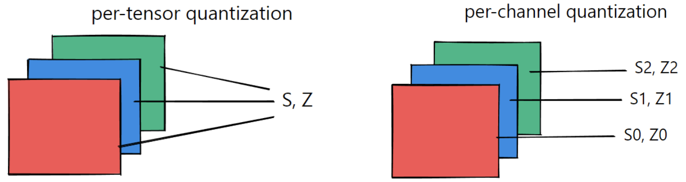

# 🤝 量化粒度

量化中非常重要的概念: Quantization Granularity(量化粒度) 指的是对于一个Tensor，以多大的粒度去共享scale和z，或者dynamic range。

根据分组的依据不同，量化粒度有多种形式：

* per-tensor/per-layer
* per-channel/per-axis
* per-col/per-row
* per-embeding/per-token
* per-block/group


一般来说，量化粒度越小，需要额外存储的量化系数就越多，比如针对卷积运算常见的 per-tensor/per-channel 量化，如下图所示，per-tensor 只需一组 (S, Z) 量化系数，而 per-channel 需要多组，提升了量化精度，但同时会一定程度增加量化后数据的大小

<figure><figcaption></figcaption></figure>

<figure><figcaption></figcaption></figure>

* Per-tensor量化&#x20;
  * &#x20;优点：低延迟: 一个tensor共享同一个量化参数&#x20;
  * &#x20;缺点：高错误率: 一个scale很难覆盖所有FP32的 dynamic range
* Per-channel (layer)量化&#x20;
  * 优点：低错误率: 每一个channel都有自己的scale 来体现这个channel中的数据的dynamic range&#x20;
  * 缺点：高延迟: 需要使用vector来存储每一个 channel的scale

从很多实验结果与测试中，对于weight和activation values的量化方法，一般会选取&#x20;

* <mark style="color:red;">对于activation values，选取per-tensor量化</mark>&#x20;
* <mark style="color:red;">对于weights，选取per-channel量化</mark>

为什么weight需要per-channel呢？主要是因为&#x20;

* BN计算与线性计算的融合 (BN folding)&#x20;

线性变化𝑦=𝑤∗𝑥的BN folding可以把BN的参数融合在线性计算中。但是BN的可参数是per-channel的。如果 weights用per-tensor的话，会掉精度。

* depthwise convolution

depthwise convolution中kernel的channel size是1，每一个kernel针对输入的对应的channel做卷积。所以每一个 channel中的参数可能差别会比较大。如果用per-tensor的话容易掉精度比较严重

```latex
e.g. 
• MobileNet: (FP32) 71.88, 
• MobileNet: (int8 Per-channel weight quantization)  71.56
 • MobileNet: (int8 Per-tensor weight quantization)  66.88
 • EfficientNet: (FP32) 76.85, 
• EfficientNet: (int8 Per-channel weight quantization)  76.72
 • EfficientNet: (int8 Per-tensor weight quantization)  12.93
```

目前的TensorRT已经默认对于Activation values选用Per-tensor，Weights选用 Per-channel，这是他们做了多次实验所得出的结果。很多其他平台的SDK可能不会 提供一些默认的量化策略，这时我们需要谨慎选择，尽快找到掉点的原因。

