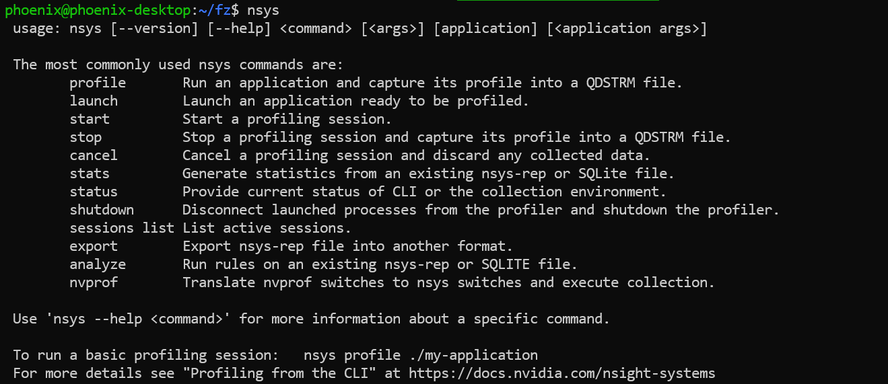

# 🐼 trtexec的使用

### trtexec常用命令行标志 <a href="#trtexec-e5-b8-b8-e7-94-a8-e5-91-bd-e4-bb-a4-e8-a1-8c-e6-a0-87-e5-bf-97" id="trtexec-e5-b8-b8-e7-94-a8-e5-91-bd-e4-bb-a4-e8-a1-8c-e6-a0-87-e5-bf-97"></a>

该部分列出了常用的trtexec命令行标志。

**构建阶段的标志**

* `--onnx=<model>` ：指定输入 ONNX 模型。
* `--deploy=<caffe_prototxt>` ：指定输入的 Caffe `prototxt` 模型。
* `--uff=<model>` ：指定输入 UFF 模型。
* `--output=<tensor>` ：指定输出张量名称。仅当输入模型为 UFF 或 Caffe 格式时才需要。
* `--maxBatch=<BS>` ：指定构建引擎的最大批量大小。仅当输入模型为 UFF 或 Caffe 格式时才需要。如果输入模型是 ONNX 格式，请使用`--minShapes` 、 `--optShapes` 、 `--maxShapes`标志来控制输入形状的范围，包括批量大小。
* `--minShapes=<shapes>` , `--optShapes=<shapes>` , `--maxShapes=<shapes>` ：指定用于构建引擎的输入形状的范围。仅当输入模型为 ONNX 格式时才需要。
* `--workspace=<size in MB>` ：指定策略允许使用的最大工作空间大小。该标志已被弃用。可以改用`--memPoolSize=<pool_spec>`标志。
* `--memPoolSize=<pool_spec>` ：指定策略允许使用的工作空间的最大大小，以及 DLA 将分配的每个可加载的内存池的大小。
* `--saveEngine=<file>` ：指定保存引擎的路径。
* `--fp16` 、 `--int8` 、 `--noTF32` 、 `--best` ：指定网络级精度。
* `--sparsity=[disable|enable|force]` ：指定是否使用支持结构化稀疏的策略。
  * `disable` ：使用结构化稀疏禁用所有策略。这是默认设置。
  * `enable` ：使用结构化稀疏启用策略。只有当 ONNX 文件中的权重满足结构化稀疏性的要求时，才会使用策略。
  * `force` ：使用结构化稀疏启用策略，并允许 `trtexec` 覆盖 `ONNX` 文件中的权重，以强制它们具有结构化稀疏模式。请注意，不会保留准确性，因此这只是为了获得推理性能。
* `--timingCacheFile=<file>` ：指定要从中加载和保存的时序缓存。

> 这个参数允许程序从指定的文件中加载先前保存的时序缓存数据，并在程序运行结束时保存新的时序缓存数据到这个文件。时序缓存通常包含了执行特定任务所需时间的数据，这有助于程序在未来运行时更加高效。
>
> 在具体的上下文中，这个参数的作用可能有所不同，但基本原理是一致的：
>
> 1. **加载时序缓存**：程序启动时，会检查`--timingCacheFile=<file>`参数指定的文件。如果文件存在，程序会加载文件中的时序缓存数据。这些数据可能包括了之前程序运行的一些性能指标，如特定操作的平均执行时间等。
> 2. **优化性能**：程序可以利用加载的时序缓存数据来优化其执行。例如，如果缓存数据显示某个操作通常需要较长时间执行，程序可能会选择一个更高效的算法来完成这个操作。
> 3. **保存时序缓存**：程序执行完毕后，会将此次运行的时序数据保存到指定的文件中。这意味着，下一次程序运行时，可以利用这些数据来进一步优化性能。
>
> 这个机制特别适用于那些执行复杂计算或频繁运行的程序，使用时序缓存可以显著减少程序的运行时间，特别是在处理重复或相似任务时。

* `--verbose` ：**打开详细日志记录。**
* `--buildOnly` ：在不运行推理的情况下构建并保存引擎。
* `--profilingVerbosity=[layer_names_only|detailed|none]` ：指定用于构建引擎的分析详细程度。
* `--dumpLayerInfo , --exportLayerInfo=<file>` ：打印/保存引擎的层信息。
* `--precisionConstraints=spec`：控制精度约束设置。
  * `none` ：没有限制。
  * `prefer` ：如果可能，满足`--layerPrecisions / --layerOutputTypes`设置的精度约束。
  * `obey`：满足由`--layerPrecisions / --layerOutputTypes`设置的精度约束，否则失败。
* `--layerPrecisions=spec` ：控制每层精度约束。仅当PrecisionConstraints设置为服从或首选时才有效。规范是从左到右阅读的，后面的会覆盖前面的。 “ \* ”可以用作layerName来指定所有未指定层的默认精度。
  * 例如： `--layerPrecisions=:fp16`,`layer_1:fp32`将所有层的精度设置为`FP16` ，除了 `layer_1` 将设置为 `FP32`。
* `--layerOutputTypes=spec` ：控制每层输出类型约束。仅当`PrecisionConstraints`设置为服从或首选时才有效。规范是从左到右阅读的，后面的会覆盖前面的。 “ \* ”可以用作`layerName`来指定所有未指定层的默认精度。如果一个层有多个输出，则可以为该层提供用“ + ”分隔的多种类型。
  * 例如： `--layerOutputTypes=:fp16`,`layer_1:fp32+fp16`将所有层输出的精度设置为`FP16` ，但 `layer_1` 除外，其第一个输出将设置为 `FP32`，其第二个输出将设置为 `FP16`。

**推理阶段的标志**

* `--loadEngine=<file>` ：从序列化计划文件加载引擎，而不是从输入 ONNX、UFF 或 Caffe 模型构建引擎。
* `--batch=<N>` ：指定运行推理的批次大小。仅当输入模型为 UFF 或 Caffe 格式时才需要。如果输入模型是 ONNX 格式，或者引擎是使用显式批量维度构建的，请改用`--shapes` 。
* `--shapes=<shapes>` ：指定要运行推理的输入形状。
* `--useCudaGraph` ：将推理捕获到 CUDA 图并通过启动图来运行推理。当构建的 TensorRT 引擎包含 CUDA 图捕获模式下不允许的操作时，可以忽略此参数。
* `--noDataTransfers` ：关闭主机到设备和设备到主机的数据传输。
* `--streams=<N>` ：并行运行多个流的推理。
* `--verbose` ：**打开详细日志记录。**
* `--dumpProfile, --exportProfile=<file>` ：打印/保存每层性能配置文件。
* `--iterations=N` ：Run at least N inference iterations (default = 10)推理次数
* `--warmUp=N`：Run for N milliseconds to warmup before measuring performance (default = 200)
* `--duration=N`：Run performance measurements for at least N seconds wallclock time (default = 3)
* `--streams=N`：Instantiate N engines to use concurrently (default = 1)

有关所有受支持的标志和详细说明，请参阅`trtexec --help` 。

使用 trtexec 工具对模型的编译工作，内容如下：

🚀**写一个静态的 onnx**

* 基本的模型导出和编译
* `trtexec --onnx=static.onnx --saveEngine=static.engine`
* `trtexec --loadEngine=static.engine`
* 让模型持续运行，并进行压测
* `trtexec --loadEngine=static.engine --duration=1000`
* `watch -n 0.1 nvidia-smi (Linux) nvidia-smi -l 1 (Windows)` 查看是否运行

🚀**写一个动态的 onnx**

* 基本的模型导出
* 编译模型，设置动态 shape 参数
* `trtexec --onnx=dynamic.onnx --minShapes=x:1x1x3x3 --optShapes=x:50x1x3x3 –maxShapes=x:100x1x3x3 --saveEngine=dynamic.engine`
* `trtexec --loadEngine=dynamic.engine --shapes=x:100x1x3x3`

### 使用命令 <a href="#e4-bd-bf-e7-94-a8-e5-91-bd-e4-bb-a4" id="e4-bd-bf-e7-94-a8-e5-91-bd-e4-bb-a4"></a>

1. **build**

```shell
bash tools/build.sh models/sample-cbr.onnx fp32
```

`tools/build.sh`文件内容如下：

```bash
#!/bin/bash
# how to use:
#   bash tools/build.sh ${input.onnx} ${tag}
# bash tools/build.sh models/sample-cbr.onnx fp32
IFS=. file=(${1})
IFS=/ file=(${file})
IFS=
PREFIX=${file[1]}


if [[ ${2} != "" ]]
then
        PREFIX=${PREFIX}-${2}
fi

MODE="build"
ONNX_PATH="models"
BUILD_PATH="build"
ENGINE_PATH=$BUILD_PATH/engines
LOG_PATH=${BUILD_PATH}"/log/"${PREFIX}"/"${MODE}

mkdir -p ${ENGINE_PATH}
mkdir -p $LOG_PATH

trtexec --onnx=${1} \
        --memPoolSize=workspace:4096 \
        --saveEngine=${ENGINE_PATH}/${PREFIX}.engine \
        --profilingVerbosity=detailed \
        --dumpOutput \
        --dumpProfile \
        --dumpLayerInfo \
        --exportOutput=${LOG_PATH}/build_output.log\
        --exportProfile=${LOG_PATH}/build_profile.log \
        --exportLayerInfo=${LOG_PATH}/build_layer_info.log \
        --warmUp=200 \
        --iterations=50 \
        --verbose \
        > ${LOG_PATH}/build.log

```

* `build_layer_info.log`可以观察到**CBR合并成一个layer**了

```tex
[
  { "count" : 41400 }
, { "name" : "/conv1/Conv + /act1/Relu", "timeMs" : 1160.78, "averageMs" : 0.0280382, "medianMs" : 0.027872, "percentage" : 100 }
]
```

* `build_output.log`可以查看模型的输出结果
* `build_profile.log`可以查看模型的运行时间

2. **infer(只读取不创建引擎)**

```shell
bash tools/infer.sh build/engines/sample-cbr-fp32.engine 
```

`tools/infer.sh`文件内容如下：

```sh
#!/bin/bash
# how to use:
#   bash tools/infer.sh ${input.engine}

IFS=. file=(${1})
IFS=/ file=(${file})
IFS=
PREFIX=${file[2]}


if [[ ${2} != "" ]]
then
        PREFIX=${PREFIX}-${2}
fi

MODE="infer"
ONNX_PATH="models"
BUILD_PATH="build"
ENGINE_PATH=$BUILD_PATH/engines
LOG_PATH=${BUILD_PATH}"/log/"${PREFIX}"/"${MODE}

mkdir -p ${ENGINE_PATH}
mkdir -p $LOG_PATH

trtexec --loadEngine=${ENGINE_PATH}/${PREFIX}.engine \
        --dumpOutput \
        --dumpProfile \
        --dumpLayerInfo \
        --exportOutput=${LOG_PATH}/infer_output.log\
        --exportProfile=${LOG_PATH}/infer_profile.log \
        --exportLayerInfo=${LOG_PATH}/infer_layer_info.log \
        --warmUp=200 \
        --iterations=50 \
        > ${LOG_PATH}/infer.log

```

3. **profile**：**需要下载好nsys这个二进制文件**

<figure><figcaption></figcaption></figure>

```shell
bash tools/profile.sh build/engines/sample-cbr-fp32.engine 
```

`tools/profile.sh`文件内容如下：

```c
#!/bin/bash
# how to use:
#   bash tools/profile.sh ${input.engine} 

IFS=. file=(${1})
IFS=/ file=(${file})
IFS=
PREFIX=${file[2]}


if [[ ${2} != "" ]]
then
        PREFIX=${PREFIX}-${2}
fi

MODE="profile"
ONNX_PATH="models"
BUILD_PATH="build"
ENGINE_PATH=$BUILD_PATH/engines
LOG_PATH=${BUILD_PATH}"/log/"${PREFIX}"/"${MODE}

mkdir -p ${ENGINE_PATH}
mkdir -p $LOG_PATH

nsys profile \
        --output=${LOG_PATH}/${PREFIX} \
        --force-overwrite true \
        trtexec --loadEngine=${ENGINE_PATH}/${PREFIX}.engine \
                --warmUp=0 \
                --duration=0 \
                --iterations=20 \
                --noDataTransfers \
    > ${LOG_PATH}/profile.log


```

打开`CUDA HW`(Hardware)查看相关的信息


* 根据日志查看已经注册好的插件


* 使用Myelin对模型结构进行图优化：层融合，删除部分节点…


### reference <a href="#reference" id="reference"></a>

* [如何熟练的使用trtexec-CSDN博客](https://blog.csdn.net/qq\_40672115/article/details/130567829)
